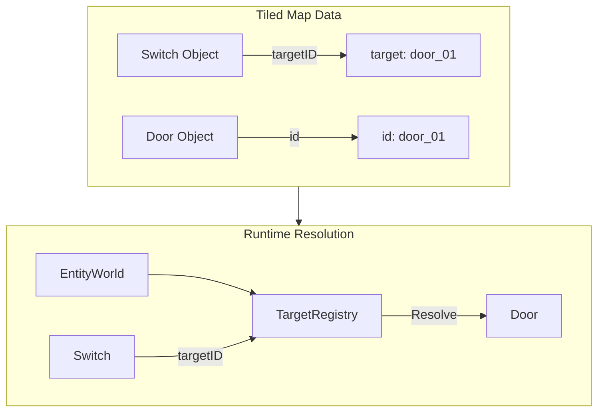

# Architecture Improvements Design Document

This document outlines two architecture improvements for the GoP game project: unifying camera ownership/rendering API and decoupling the Switch-Door relationship.

## Table of Contents

1. [Improvement 1: Unify Camera Ownership + Rendering API](#improvement-1-unify-camera-ownership--rendering-api)
2. [Improvement 2: Decouple Switch ↔ Door](#improvement-2-decouple-switch--door)

---

## Improvement 1: Unify Camera Ownership + Rendering API

### Current State Analysis

#### Two Camera Implementations

The codebase currently has **two separate camera implementations**:

1. **[`internal/camera/camera.go`](internal/camera/camera.go)** - A sophisticated camera with:
   - Deadzone-based following
   - Exponential smoothing
   - Level bounds clamping
   - Pixel-perfect snapping
   - `WorldToScreen()` and `ScreenToWorld()` helpers

2. **[`internal/world/render.go`](internal/world/render.go:8-64)** - A simpler Camera struct:
   - Basic `CenterOn()` method
   - `VisibleBounds()` for tile culling
   - `WorldToScreen()` / `ScreenToWorld()` methods

This duplication causes confusion and maintenance burden.

#### Camera Coordinate Plumbing

The [`Entity`](internal/entities/entity.go:11-20) interface defines:

```go
type Entity interface {
    Update(dt float64)
    Draw(screen *ebiten.Image, camX, camY float64)
    Bounds() physics.AABB
}
```

Raw `camX, camY` values are passed through multiple layers:

- [`EntityWorld.Draw()`](internal/entities/world.go:78-82) receives and forwards camX, camY
- [`MapRenderer.Draw()`](internal/world/render.go:87-146) receives camX, camY
- Individual entities like [`Switch.Draw()`](internal/entities/switch.go:62-87) manually compute screen positions

#### Scene Integration

In [`sandbox/scene.go`](internal/scenes/sandbox/scene.go:463-471):

```go
func (s *Scene) Draw(screen *ebiten.Image) {
    s.renderer.Draw(screen, s.camera.X, s.camera.Y)
    s.entityWorld.Draw(screen, s.camera.X, s.camera.Y)
    // ...
}
```

The scene manually extracts `X, Y` from the enhanced camera and passes them as raw floats.

### Proposed Solution: RenderContext

#### Design

Introduce a `RenderContext` struct that encapsulates all render state:

```go
// RenderContext holds all state needed for rendering.
type RenderContext struct {
    // Camera reference for coordinate transforms
    Cam *camera.Camera
    
    // Debug mode toggles
    Debug bool
    
    // Delta time for any time-based visual effects
    DT float64
    
    // Screen bounds for culling (optional optimization)
    ScreenW, ScreenH int
}
```

#### Updated Entity Interface

```go
// Entity is the base interface for all game entities.
type Entity interface {
    Update(dt float64)
    Draw(screen *ebiten.Image, ctx *RenderContext)
    Bounds() physics.AABB
}
```

#### Helper Methods on RenderContext

```go
// WorldToScreen converts world coordinates to screen coordinates.
func (ctx *RenderContext) WorldToScreen(x, y float64) (screenX, screenY float64) {
    return x - ctx.Cam.X, y - ctx.Cam.Y
}

// ScreenToWorld converts screen coordinates to world coordinates.
func (ctx *RenderContext) ScreenToWorld(x, y float64) (worldX, worldY float64) {
    return x + ctx.Cam.X, y + ctx.Cam.Y
}

// IsVisible checks if an AABB is within the camera viewport.
func (ctx *RenderContext) IsVisible(aabb physics.AABB) bool {
    camBounds := physics.AABB{
        X: ctx.Cam.X,
        Y: ctx.Cam.Y,
        W: float64(ctx.Cam.ViewportW),
        H: float64(ctx.Cam.ViewportH),
    }
    return aabb.Intersects(camBounds)
}
```

#### Updated EntityWorld

```go
// Draw renders all entities with the render context.
func (w *EntityWorld) Draw(screen *ebiten.Image, ctx *RenderContext) {
    for _, e := range w.entities {
        // Optional: visibility culling
        if ctx.IsVisible(e.Bounds()) {
            e.Draw(screen, ctx)
        }
    }
}
```

#### Updated Switch Example

Before:
```go
func (s *Switch) Draw(screen *ebiten.Image, camX, camY float64) {
    x := s.bounds.X - camX
    y := s.bounds.Y - camY
    // ...
}
```

After:
```go
func (s *Switch) Draw(screen *ebiten.Image, ctx *RenderContext) {
    x, y := ctx.WorldToScreen(s.bounds.X, s.bounds.Y)
    // ...
    
    // Debug rendering now available
    if ctx.Debug {
        s.drawDebug(screen, ctx)
    }
}
```

### Migration Strategy

#### Phase 1: Add RenderContext (Non-Breaking)

1. Create `internal/render/context.go` with `RenderContext` struct
2. Add `DrawWithCtx(screen, ctx)` method to Entity interface as an optional extension
3. Update `EntityWorld` to have both `Draw()` and `DrawWithCtx()`

#### Phase 2: Update Implementations

1. Update each entity implementation to support the new signature
2. Update `MapRenderer` to accept `RenderContext`
3. Remove the duplicate `world.Camera` struct

#### Phase 3: Remove Old API

1. Change `Entity.Draw()` signature to use `RenderContext`
2. Remove `camX, camY` parameters throughout
3. Update all call sites

### Benefits

1. **Single source of truth** - One camera implementation
2. **Cleaner signatures** - No more `camX, camY` plumbing
3. **Extensibility** - Easy to add debug flags, screen bounds, etc.
4. **Visibility culling** - Built-in support for off-screen culling
5. **Testability** - Easier to mock render state in tests

---

## Improvement 2: Decouple Switch ↔ Door

### Current State Analysis

#### Direct Pointer Coupling

In [`internal/entities/switch.go`](internal/entities/switch.go:13-23):

```go
type Switch struct {
    bounds     physics.AABB
    state      TriggerState
    targetID   string      // ID from Tiled map
    toggleMode bool
    once       bool
    used       bool
    
    // Direct reference - the coupling problem
    targetDoor *Door
}
```

The Switch holds a direct `*Door` pointer, creating tight coupling.

#### Resolution During Spawning

In [`internal/gameplay/spawner.go`](internal/gameplay/spawner.go:74-83):

```go
// Second pass: link switches to doors
for i, sw := range switches {
    if sw.TargetID() != "" && ctx.GetDoor != nil {
        door := ctx.GetDoor(sw.TargetID())
        if door != nil {
            sw.SetTargetDoor(door)
        }
    }
}
```

The [`SpawnContext`](internal/gameplay/spawner.go:9-14) provides a callback:

```go
type SpawnContext struct {
    OnDeath       func()
    OnCheckpoint  func(id string, x, y float64)
    OnGoalReached func()
    GetDoor       func(id string) *entities.Door
}
```

#### Direct Method Calls

In [`Switch.OnEnter()`](internal/entities/switch.go:95-116):

```go
func (s *Switch) OnEnter(player *physics.Body) {
    if !s.state.Active {
        return
    }
    
    if s.targetDoor == nil {
        return
    }
    
    // Direct method calls on Door
    if s.toggleMode {
        s.targetDoor.Toggle()
    } else {
        s.targetDoor.Open()
    }
}
```

### Problems with Current Design

1. **Tight coupling** - Switch can only control Doors
2. **Serialization difficulty** - Pointer references can't be serialized
3. **No extensibility** - Cannot target multiple entities
4. **Testing complexity** - Must create real Door instances to test Switch

### Proposed Solution: Target Registry Pattern

#### Design Overview



#### Targetable Interface

```go
// Targetable represents an entity that can be controlled by switches.
type Targetable interface {
    // Activate performs the primary action - open, enable, etc.
    Activate()
    
    // Deactivate performs the inverse action - close, disable, etc.
    Deactivate()
    
    // Toggle switches between states.
    Toggle()
    
    // TargetID returns the unique identifier for targeting.
    TargetID() string
}
```

#### Target Registry

```go
// TargetRegistry resolves target IDs to Targetable entities.
type TargetRegistry struct {
    targets map[string]Targetable
}

func NewTargetRegistry() *TargetRegistry {
    return &TargetRegistry{
        targets: make(map[string]Targetable),
    }
}

// Register adds a targetable entity to the registry.
func (r *TargetRegistry) Register(t Targetable) {
    r.targets[t.TargetID()] = t
}

// Resolve finds a target by ID. Returns nil if not found.
func (r *TargetRegistry) Resolve(id string) Targetable {
    return r.targets[id]
}
```

#### Updated Switch Implementation

```go
type Switch struct {
    bounds     physics.AABB
    state      TriggerState
    targetID   string      // Still stores ID from map
    toggleMode bool
    once       bool
    used       bool
    
    // Registry reference instead of direct Door pointer
    registry   *TargetRegistry
}

// NewSwitch creates a switch with registry reference.
func NewSwitch(x, y, w, h float64, targetID string, registry *TargetRegistry) *Switch {
    return &Switch{
        bounds:   physics.AABB{X: x, Y: y, W: w, H: h},
        state:    NewTriggerState(),
        targetID: targetID,
        registry: registry,
    }
}

func (s *Switch) OnEnter(player *physics.Body) {
    if !s.state.Active {
        return
    }
    
    // Resolve target at runtime
    target := s.registry.Resolve(s.targetID)
    if target == nil {
        return
    }
    
    if s.toggleMode {
        target.Toggle()
    } else {
        target.Activate()
    }
    
    if s.once {
        s.used = true
        s.state.Active = false
    }
}
```

#### Door Implements Targetable

```go
// Door already has the necessary methods, just need to add TargetID.
func (d *Door) TargetID() string {
    return d.id
}

// Activate opens the door.
func (d *Door) Activate() {
    d.Open()
}

// Deactivate closes the door.
func (d *Door) Deactivate() {
    d.Close()
}
```

### Alternative: Event-Based Design

For more flexibility, consider an event bus approach:

```go
// Event types
type ActivateTarget struct {
    TargetID string
}

type DeactivateTarget struct {
    TargetID string
}

type ToggleTarget struct {
    TargetID string
}

// EventBus routes events to handlers.
type EventBus struct {
    handlers map[string][]func(any)
}

func (b *EventBus) Emit(event any) {
    // Route to registered handlers
}

func (b *EventBus) Subscribe(targetID string, handler func(any)) {
    // Register handler for target
}
```

Switch with events:

```go
func (s *Switch) OnEnter(player *physics.Body) {
    if s.toggleMode {
        s.events.Emit(ToggleTarget{TargetID: s.targetID})
    } else {
        s.events.Emit(ActivateTarget{TargetID: s.targetID})
    }
}
```

Door subscribes to events:

```go
func (d *Door) Subscribe(events *EventBus) {
    events.Subscribe(d.id, func(e any) {
        switch e.(type) {
        case ActivateTarget:
            d.Open()
        case DeactivateTarget:
            d.Close()
        case ToggleTarget:
            d.Toggle()
        }
    })
}
```

### Future Extensibility

The registry pattern supports:

| Feature | Implementation |
|---------|---------------|
| Multiple targets | Store `[]targetID` in Switch, resolve all |
| Timed doors | Create `TimedDoor` implementing Targetable |
| Pressure plates | Create `PressurePlate` implementing Targetable |
| Remote triggers | Create `RemoteTrigger` implementing Targetable |
| Chain reactions | Targetable.Activate() can emit events |

### Migration Strategy

#### Phase 1: Add Infrastructure (Non-Breaking)

1. Create `Targetable` interface in `internal/entities/target.go`
2. Create `TargetRegistry` in same file
3. Add `TargetID()`, `Activate()`, `Deactivate()` methods to Door

#### Phase 2: Update Spawning

1. Create `TargetRegistry` in scene initialization
2. Register all Targetable entities during spawn
3. Pass registry to Switch constructor

#### Phase 3: Update Switch

1. Replace `*Door` with `*TargetRegistry`
2. Update `OnEnter()` to use registry resolution
3. Remove `SetTargetDoor()` method

#### Phase 4: Cleanup

1. Remove `GetDoor` callback from `SpawnContext`
2. Remove direct Door coupling from Switch
3. Update any tests

### Benefits

1. **Decoupling** - Switch knows nothing about Door implementation
2. **Serialization** - Only `targetID` string needs serialization
3. **Extensibility** - Any entity can implement Targetable
4. **Testability** - Easy to create mock Targetable for tests
5. **Multiple targets** - Natural extension to target lists

---

## Risks and Considerations

### Improvement 1 Risks

| Risk | Mitigation |
|------|------------|
| Breaking existing code | Use phased migration with backward compatibility |
| Performance overhead | RenderContext is passed by pointer; minimal overhead |
| Learning curve | Document the pattern; similar to context.Context |

### Improvement 2 Risks

| Risk | Mitigation |
|------|------------|
| Runtime resolution failures | Log warnings when target not found |
| Registry lifecycle | Clear documentation on when to register |
| Thread safety | Not a concern for single-threaded Ebiten |

---

## Summary

### Improvement 1: RenderContext

- **Problem**: Two camera implementations, raw coordinate plumbing
- **Solution**: Single `RenderContext` passed to Draw methods
- **Impact**: Cleaner API, better extensibility, visibility culling support

### Improvement 2: Target Registry

- **Problem**: Direct Switch→Door pointer coupling
- **Solution**: Registry pattern with `Targetable` interface
- **Impact**: Decoupled design, serialization-friendly, extensible to new target types

Both improvements follow the principle of **dependency injection via interfaces** rather than direct struct coupling, making the codebase more maintainable and testable.

---

## Implementation Status

### ✅ IMPROVEMENT 1: RenderContext Pattern — IMPLEMENTED

**Date:** 2026-02-16

**Summary:**
The RenderContext pattern has been fully implemented in [`internal/world/render_context.go`](internal/world/render_context.go).

**Implementation Details:**
- Created `RenderContext` struct with `Cam`, `Debug`, `DT`, and `Screen` fields
- Implemented helper methods:
  - `WorldToScreen(worldX, worldY)` - converts world coordinates to screen coordinates
  - `ScreenToWorld(screenX, screenY)` - converts screen coordinates to world coordinates
  - `IsVisible(worldX, worldY, width, height)` - checks if a rect is visible in viewport
  - `CameraX()`, `CameraY()` - backward compatibility helpers
- Unified camera ownership: single `camera.Camera` implementation in `internal/camera/`
- Removed the duplicate simple Camera struct from `internal/world/render.go`

**Deviations from Original Design:**
- `IsVisible()` takes `worldX, worldY, width, height` parameters instead of an `AABB`
- Added `Screen` field to hold the target image buffer
- Added `NewRenderContext()` constructor function

---

### ✅ IMPROVEMENT 2: Target Registry Pattern — IMPLEMENTED

**Date:** 2026-02-16

**Summary:**
The Target Registry pattern has been fully implemented in [`internal/entities/targetable.go`](internal/entities/targetable.go).

**Implementation Details:**
- Created `Targetable` interface with `Activate()`, `Deactivate()`, `Toggle()`, and `TargetID()` methods
- Created `TargetRegistry` struct with:
  - `Register(t Targetable)` - adds target to registry
  - `Unregister(t Targetable)` - removes target from registry
  - `Resolve(id string) Targetable` - looks up target by ID
  - `HasTarget(id string) bool` - checks if target exists
  - `AllTargets() []Targetable` - returns all registered targets
- Switch now uses `targetID string` + `*TargetRegistry` instead of `*Door`
- Door implements `Targetable` interface

**Deviations from Original Design:**
- Added `Unregister()` method for cleanup scenarios
- Added `HasTarget()` convenience method
- Added `AllTargets()` for debugging/iteration
- Nil-safe implementations in all registry methods

**Benefits Realized:**
- Switch entities are now decoupled from Door implementation
- Target IDs can be serialized directly from Tiled map data
- Any entity can implement `Targetable` to become a valid switch target
- Testing is simplified with mock `Targetable` implementations
