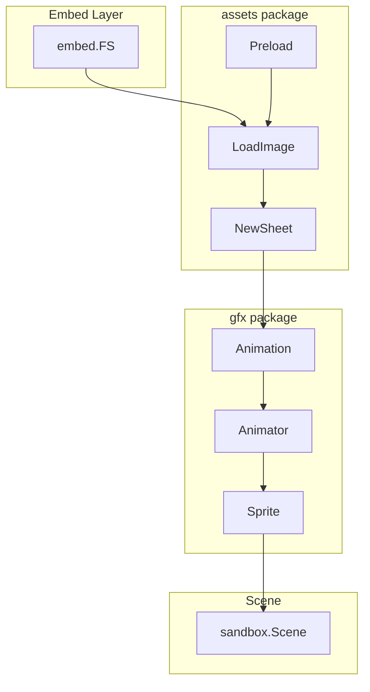

# Asset Loading and Sprite Rendering Design

## Overview

This document outlines the design for implementing asset loading, sprite rendering, and basic animation support for the GoP Ebitengine game.

## Analysis of Existing Patterns

### Project Structure

The codebase follows a clean architecture pattern:

```
GoP/
├── cmd/
│   └── game/main.go        # Entry point
├── internal/
│   ├── app/                 # Application core
│   ├── input/               # Input abstraction
│   └── scenes/sandbox/      # Scene implementation
└── go.mod
```

### Key Patterns Observed

#### 1. Constructor Pattern
All types use `New()` constructor functions returning pointers:

```go
// From internal/app/app.go
func New(cfg *Config) *App

// From internal/input/input.go
func NewInput() *Input

// From internal/scenes/sandbox/scene.go
func New() *Scene
```

#### 2. Interface-Based Design
The [`Scene`](internal/app/app.go:12) interface defines clear contracts:

```go
type Scene interface {
    Update(inp *input.Input) error
    Draw(screen *ebiten.Image)
    Layout(outsideW, outsideH int) (int, int)
    DebugInfo() string
}
```

#### 3. Configuration Structs
Configuration uses dedicated structs with defaults:

```go
// From internal/app/config.go
type Config struct {
    WindowWidth  int
    WindowHeight int
    WindowTitle  string
    DebugMode    bool
}

func DefaultConfig() *Config
```

#### 4. Input Abstraction
The [`input`](internal/input/input.go:1) package provides action-based input:

```go
type Action int
type Input struct { ... }
func (i *Input) Pressed(action Action) bool
func (i *Input) JustPressed(action Action) bool
```

#### 5. Dependency Injection
The app passes dependencies to scenes via method parameters:

```go
func (s *Scene) Update(inp *input.Input) error
```

---

## Proposed Architecture

### Package Structure

```
internal/
├── assets/
│   ├── assets.go    // Embed FS and asset registry
│   ├── images.go    // Image loading utilities
│   └── sheet.go     // Spritesheet slicing
├── gfx/
│   ├── sprite.go    // Sprite structure
│   ├── animation.go // Animation data
│   └── animator.go  // Animation playback
└── ...existing packages
```

### Directory Structure for Assets

```
assets/
├── images/
│   └── sprites/
│       └── player.png
└── fonts/
    └── (future use)
```

---

## API Design

### internal/assets/assets.go

Handles embedding and asset registry.

```go
// Package assets provides embedded game assets and loading utilities.
package assets

import (
    "embed"
    "io/fs"
)

//go:embed assets/*
var gameAssets embed.FS

// FS returns the embedded filesystem for direct access.
func FS() embed.FS {
    return gameAssets
}

// SubFS returns a sub-filesystem rooted at the given path.
func SubFS(path string) (fs.FS, error) {
    return fs.Sub(gameAssets, path)
}
```

### internal/assets/images.go

PNG decoding and Ebiten image creation.

```go
package assets

import (
    "fmt"
    "image"
    _ "image/png" // PNG decoder
    "io/fs"

    "github.com/hajimehoshi/ebiten/v2"
)

// LoadImage loads an image from the embedded filesystem and converts it to *ebiten.Image.
func LoadImage(path string) (*ebiten.Image, error) {
    file, err := gameAssets.Open(path)
    if err != nil {
        return nil, fmt.Errorf("failed to open image %s: %w", path, err)
    }
    defer file.Close()

    img, _, err := image.Decode(file)
    if err != nil {
        return nil, fmt.Errorf("failed to decode image %s: %w", path, err)
    }

    return ebiten.NewImageFromImage(img), nil
}

// LoadImageFromFS loads an image from a custom filesystem.
func LoadImageFromFS(fsys fs.FS, path string) (*ebiten.Image, error) {
    file, err := fsys.Open(path)
    if err != nil {
        return nil, fmt.Errorf("failed to open image %s: %w", path, err)
    }
    defer file.Close()

    img, _, err := image.Decode(file)
    if err != nil {
        return nil, fmt.Errorf("failed to decode image %s: %w", path, err)
    }

    return ebiten.NewImageFromImage(img), nil
}
```

### internal/assets/sheet.go

Spritesheet slicing utilities.

```go
package assets

import (
    "github.com/hajimehoshi/ebiten/v2"
)

// SpriteFrame represents a single frame position in a spritesheet.
type SpriteFrame struct {
    X int
    Y int
    W int
    H int
}

// Sheet represents a spritesheet with sliced frames.
type Sheet struct {
    image  *ebiten.Image
    frames []*ebiten.Image
}

// NewSheet creates a new spritesheet from an image with uniform frame size.
func NewSheet(img *ebiten.Image, frameWidth, frameHeight int) *Sheet {
    bounds := img.Bounds()
    sheetW, sheetH := bounds.Dx(), bounds.Dy()
    
    cols := sheetW / frameWidth
    rows := sheetH / frameHeight
    
    frames := make([]*ebiten.Image, 0, cols*rows)
    
    for row := 0; row < rows; row++ {
        for col := 0; col < cols; col++ {
            x := col * frameWidth
            y := row * frameHeight
            frame := img.SubImage(image.Rect(x, y, x+frameWidth, y+frameHeight)).(*ebiten.Image)
            frames = append(frames, frame)
        }
    }
    
    return &Sheet{
        image:  img,
        frames: frames,
    }
}

// Frame returns the frame at the given index.
func (s *Sheet) Frame(index int) *ebiten.Image {
    if index < 0 || index >= len(s.frames) {
        return nil
    }
    return s.frames[index]
}

// FrameCount returns the total number of frames.
func (s *Sheet) FrameCount() int {
    return len(s.frames)
}

// Frames returns all frames as a slice.
func (s *Sheet) Frames() []*ebiten.Image {
    return s.frames
}
```

### internal/gfx/sprite.go

Basic sprite structure for rendering.

```go
// Package gfx provides graphics utilities for sprites and animations.
package gfx

import (
    "github.com/hajimehoshi/ebiten/v2"
)

// Sprite represents a drawable image with position and scale.
type Sprite struct {
    Image    *ebiten.Image
    X        float64
    Y        float64
    ScaleX   float64
    ScaleY   float64
    Rotation float64
    OriginX  float64 // Origin point X (0-1 normalized)
    OriginY  float64 // Origin point Y (0-1 normalized)
}

// NewSprite creates a new sprite from an image.
func NewSprite(img *ebiten.Image) *Sprite {
    return &Sprite{
        Image:    img,
        ScaleX:   1.0,
        ScaleY:   1.0,
        Rotation: 0,
        OriginX:  0.5, // Center by default
        OriginY:  0.5,
    }
}

// Draw renders the sprite to the target image.
func (s *Sprite) Draw(target *ebiten.Image) {
    if s.Image == nil {
        return
    }
    
    bounds := s.Image.Bounds()
    w, h := bounds.Dx(), bounds.Dy()
    
    op := &ebiten.DrawImageOptions{}
    
    // Apply origin offset
    op.GeoM.Translate(-float64(w)*s.OriginX, -float64(h)*s.OriginY)
    
    // Apply scale
    op.GeoM.Scale(s.ScaleX, s.ScaleY)
    
    // Apply rotation
    op.GeoM.Rotate(s.Rotation)
    
    // Apply position
    op.GeoM.Translate(s.X, s.Y)
    
    target.DrawImage(s.Image, op)
}

// SetPosition sets the sprite position.
func (s *Sprite) SetPosition(x, y float64) {
    s.X = x
    s.Y = y
}

// SetScale sets the sprite scale uniformly.
func (s *Sprite) SetScale(scale float64) {
    s.ScaleX = scale
    s.ScaleY = scale
}

// Width returns the sprite width in pixels.
func (s *Sprite) Width() int {
    if s.Image == nil {
        return 0
    }
    return s.Image.Bounds().Dx()
}

// Height returns the sprite height in pixels.
func (s *Sprite) Height() int {
    if s.Image == nil {
        return 0
    }
    return s.Image.Bounds().Dy()
}
```

### internal/gfx/animation.go

Animation data structure.

```go
package gfx

// Animation represents a sequence of frames with playback settings.
type Animation struct {
    Name      string
    Frames    []*ebiten.Image
    FrameRate float64 // Frames per second
    Loop      bool
}

// NewAnimation creates a new animation.
func NewAnimation(name string, frames []*ebiten.Image, frameRate float64, loop bool) *Animation {
    return &Animation{
        Name:      name,
        Frames:    frames,
        FrameRate: frameRate,
        Loop:      loop,
    }
}

// FrameCount returns the number of frames in the animation.
func (a *Animation) FrameCount() int {
    return len(a.Frames)
}

// Duration returns the total duration of the animation in seconds.
func (a *Animation) Duration() float64 {
    if a.FrameRate <= 0 {
        return 0
    }
    return float64(len(a.Frames)) / a.FrameRate
}
```

### internal/gfx/animator.go

Animation playback controller.

```go
package gfx

import (
    "time"
)

// Animator handles animation playback state.
type Animator struct {
    animations    map[string]*Animation
    current       *Animation
    currentName   string
    frameIndex    int
    elapsed       time.Duration
    playing       bool
}

// NewAnimator creates a new animator.
func NewAnimator() *Animator {
    return &Animator{
        animations: make(map[string]*Animation),
    }
}

// Add registers an animation with the animator.
func (a *Animator) Add(anim *Animation) {
    a.animations[anim.Name] = anim
}

// Play starts playing the named animation.
func (a *Animator) Play(name string) {
    if a.currentName == name && a.playing {
        return // Already playing this animation
    }
    
    anim, ok := a.animations[name]
    if !ok {
        return
    }
    
    a.current = anim
    a.currentName = name
    a.frameIndex = 0
    a.elapsed = 0
    a.playing = true
}

// Stop stops the current animation.
func (a *Animator) Stop() {
    a.playing = false
}

// Reset resets the animation to the first frame.
func (a *Animator) Reset() {
    a.frameIndex = 0
    a.elapsed = 0
}

// Update advances the animation by delta time.
func (a *Animator) Update(dt time.Duration) {
    if !a.playing || a.current == nil {
        return
    }
    
    a.elapsed += dt
    
    frameDuration := time.Second / time.Duration(a.current.FrameRate)
    
    for a.elapsed >= frameDuration {
        a.elapsed -= frameDuration
        a.frameIndex++
        
        if a.frameIndex >= len(a.current.Frames) {
            if a.current.Loop {
                a.frameIndex = 0
            } else {
                a.frameIndex = len(a.current.Frames) - 1
                a.playing = false
                break
            }
        }
    }
}

// CurrentFrame returns the current frame image.
func (a *Animator) CurrentFrame() *ebiten.Image {
    if a.current == nil || a.frameIndex < 0 || a.frameIndex >= len(a.current.Frames) {
        return nil
    }
    return a.current.Frames[a.frameIndex]
}

// IsPlaying returns whether an animation is currently playing.
func (a *Animator) IsPlaying() bool {
    return a.playing
}

// CurrentAnimation returns the name of the current animation.
func (a *Animator) CurrentAnimation() string {
    return a.currentName
}

// HasAnimation returns true if the named animation exists.
func (a *Animator) HasAnimation(name string) bool {
    _, ok := a.animations[name]
    return ok
}
```

---

## Integration Points

### 1. Asset Loading in main.go

Assets should be loaded at startup before the game loop:

```go
// cmd/game/main.go
func main() {
    // Load assets first
    if err := assets.Preload(); err != nil {
        log.Fatal(err)
    }
    
    cfg := &app.Config{...}
    game := app.New(cfg)
    scene := sandbox.New()
    game.SetScene(scene)
    
    if err := game.Run(); err != nil {
        log.Fatal(err)
    }
}
```

### 2. Scene Integration

The sandbox scene will be updated to use sprites:

```go
// internal/scenes/sandbox/scene.go
type Scene struct {
    player   *gfx.Sprite
    animator *gfx.Animator
    width    int
    height   int
}

func New() *Scene {
    // Load spritesheet
    sheetImg, _ := assets.LoadImage("assets/images/sprites/player.png")
    sheet := assets.NewSheet(sheetImg, 16, 16) // 16x16 frames
    
    // Create animations
    animator := gfx.NewAnimator()
    animator.Add(gfx.NewAnimation("idle", sheet.Frames()[:4], 8, true))
    animator.Add(gfx.NewAnimation("walk", sheet.Frames()[4:8], 12, true))
    
    // Create player sprite
    player := gfx.NewSprite(animator.CurrentFrame())
    player.SetPosition(100, 100)
    
    return &Scene{
        player:   player,
        animator: animator,
    }
}

func (s *Scene) Update(inp *input.Input) error {
    // Update animation
    s.animator.Update(time.Second / 60) // Assuming 60 TPS
    
    // Update player image from animator
    s.player.Image = s.animator.CurrentFrame()
    
    // Movement logic...
    
    return nil
}

func (s *Scene) Draw(screen *ebiten.Image) {
    screen.Fill(backgroundColor)
    s.player.Draw(screen)
}
```

### 3. Optional: Preload Function

For centralized asset management:

```go
// internal/assets/assets.go
var (
    PlayerSheet *Sheet
    // ... other assets
)

// Preload loads all game assets.
func Preload() error {
    var err error
    
    img, err := LoadImage("assets/images/sprites/player.png")
    if err != nil {
        return err
    }
    PlayerSheet = NewSheet(img, 16, 16)
    
    return nil
}
```

---

## Data Flow Diagram



---

## Usage Example

Complete workflow for adding an animated character:

```go
// 1. Load the spritesheet
img, err := assets.LoadImage("assets/images/sprites/character.png")
if err != nil {
    log.Fatal(err)
}

// 2. Slice into frames
sheet := assets.NewSheet(img, 32, 32) // 32x32 pixel frames

// 3. Create animations
animator := gfx.NewAnimator()
animator.Add(gfx.NewAnimation("idle", sheet.Frames()[0:4], 6, true))
animator.Add(gfx.NewAnimation("walk_down", sheet.Frames()[4:8], 10, true))
animator.Add(gfx.NewAnimation("walk_up", sheet.Frames()[8:12], 10, true))
animator.Add(gfx.NewAnimation("walk_left", sheet.Frames()[12:16], 10, true))
animator.Add(gfx.NewAnimation("walk_right", sheet.Frames()[16:20], 10, true))

// 4. Create sprite
sprite := gfx.NewSprite(animator.CurrentFrame())
sprite.SetPosition(320, 180)

// 5. In Update loop
animator.Play("walk_down")
animator.Update(dt)
sprite.Image = animator.CurrentFrame()

// 6. In Draw loop
sprite.Draw(screen)
```

---

## Implementation Checklist

- [ ] Create `assets/` directory structure
- [ ] Implement `internal/assets/assets.go` with embed.FS
- [ ] Implement `internal/assets/images.go` with PNG loading
- [ ] Implement `internal/assets/sheet.go` with spritesheet slicing
- [ ] Implement `internal/gfx/sprite.go` with Sprite struct
- [ ] Implement `internal/gfx/animation.go` with Animation struct
- [ ] Implement `internal/gfx/animator.go` with Animator struct
- [ ] Update `internal/scenes/sandbox/scene.go` to use sprites
- [ ] Add sample sprite asset for testing

---

## Notes

1. **Thread Safety**: The current design assumes single-threaded access. Ebitengine's game loop is single-threaded, so this is safe.

2. **Memory Management**: Spritesheets share the underlying image via SubImage. The original sheet image must remain in memory.

3. **Performance**: Frame lookups are O(1). Animation updates are minimal overhead.

4. **Extensibility**: The design allows for:
   - Adding more asset types (audio, fonts)
   - Sprite batching for performance
   - More complex animation blending
   - Event callbacks on animation frames
