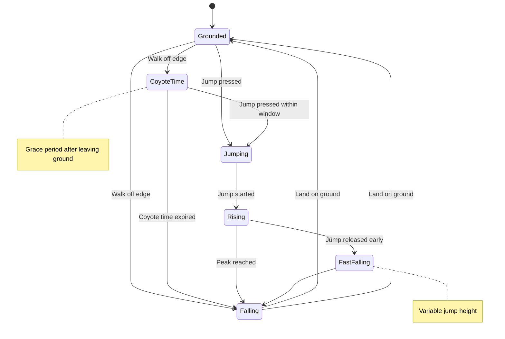

# Feel & Camera Milestone - Architecture Design

## Overview

This document describes the architecture for implementing "game feel" improvements and an enhanced camera system in the GoP 2D platformer. The design focuses on creating responsive, polished player movement and smooth camera following.

## Table of Contents

1. [Fixed Timestep System](#1-fixed-timestep-system)
2. [Tuning Parameters](#2-tuning-parameters)
3. [Camera System](#3-camera-system)
4. [Physics Controller Improvements](#4-physics-controller-improvements)
5. [Sandbox Scene Integration](#5-sandbox-scene-integration)
6. [Acceptance Criteria Mapping](#6-acceptance-criteria-mapping)

---

## 1. Fixed Timestep System

**Location:** `internal/time/timestep.go`

### 1.1 Problem Statement

Ebitengine's `Update()` runs at a variable rate (typically targeting 60 TPS but not guaranteed). For deterministic physics and smooth game feel, we need:

- Fixed timestep physics updates (exactly 60Hz)
- Variable rate rendering (as fast as possible)
- Accumulator pattern to handle frame time variations

### 1.2 Design

```go
// Package time provides fixed timestep utilities for deterministic physics.
package time

// FixedTimestep implements an accumulator pattern for fixed timestep updates.
// This ensures physics runs at a consistent rate regardless of frame rate.
type FixedTimestep struct {
    // Target tick rate in seconds (e.g., 1/60 for 60Hz)
    tickDuration float64
    
    // Accumulated time waiting to be consumed by fixed updates
    accumulator float64
    
    // Maximum frame time to prevent spiral of death
    // If a frame takes longer than this, we discard extra time
    maxFrameTime float64
    
    // Statistics for debugging
    totalTicks    int
    lastFrameTime float64
}

// NewFixedTimestep creates a new fixed timestep controller.
// hz is the target update frequency (e.g., 60 for 60Hz).
func NewFixedTimestep(hz int) *FixedTimestep {
    return &FixedTimestep{
        tickDuration:  1.0 / float64(hz),
        accumulator:   0,
        maxFrameTime:  0.25, // Max 250ms per frame
    }
}

// AddFrameTime adds elapsed time to the accumulator.
// Call this once per frame with the frame delta time.
// Returns the actual time added (clamped by maxFrameTime).
func (ft *FixedTimestep) AddFrameTime(dt float64) float64 {
    if dt > ft.maxFrameTime {
        dt = ft.maxFrameTime
    }
    ft.accumulator += dt
    ft.lastFrameTime = dt
    return dt
}

// ShouldUpdate returns true if a fixed update should run.
// Call this in a loop: for ft.ShouldUpdate() { /* physics step */ }
func (ft *FixedTimestep) ShouldUpdate() bool {
    return ft.accumulator >= ft.tickDuration
}

// ConsumeTick consumes one fixed tick from the accumulator.
// Call this after each physics update.
func (ft *FixedTimestep) ConsumeTick() {
    ft.accumulator -= ft.tickDuration
    ft.totalTicks++
}

// TickDuration returns the fixed tick duration in seconds.
func (ft *FixedTimestep) TickDuration() float64 {
    return ft.tickDuration
}

// Alpha returns the interpolation factor for rendering.
// This is used to interpolate between the previous and current physics state.
// Value is in range [0, 1), where 0 = just stepped, ~1 = about to step.
func (ft *FixedTimestep) Alpha() float64 {
    return ft.accumulator / ft.tickDuration
}

// Stats returns debugging statistics.
func (ft *FixedTimestep) Stats() (totalTicks int, lastFrameTime float64, accumulator float64) {
    return ft.totalTicks, ft.lastFrameTime, ft.accumulator
}
```

### 1.3 Integration with Ebitengine

The fixed timestep integrates with Ebitengine's Update/Draw cycle:


**Key Integration Points:**

1. **In `App.Update()`**: Use the timestep loop for physics
2. **In `App.Draw()`**: Use `Alpha()` for state interpolation (optional enhancement)
3. **Frame time source**: Use `1.0 / ebiten.ActualTPS()` or track time manually

### 1.4 Usage Pattern

```go
func (a *App) Update() error {
    // Get frame time (Ebitengine provides this via TPS)
    // For more accuracy, use time.Since(lastFrameTime)
    dt := 1.0 / 60.0 // Or calculate from actual timing
    
    // Add to accumulator
    a.timestep.AddFrameTime(dt)
    
    // Fixed update loop
    for a.timestep.ShouldUpdate() {
        // Physics update with fixed dt
        if a.scene != nil {
            if err := a.scene.FixedUpdate(a.input, a.timestep.TickDuration()); err != nil {
                return err
            }
        }
        a.timestep.ConsumeTick()
    }
    
    // Non-physics updates (UI, animations, etc.)
    if a.scene != nil {
        if err := a.scene.Update(a.input); err != nil {
            return err
        }
    }
    
    a.input.Update()
    return nil
}
```

---

## 2. Tuning Parameters

**Location:** `internal/game/tuning.go`

### 2.1 Design Philosophy

All feel-related parameters should be:
- Centralized in one struct for easy tweaking
- Named descriptively with clear units
- Organized by category (horizontal, jump, gravity)
- Have sensible defaults that can be overridden

### 2.2 Tuning Struct

```go
// Package game provides game feel tuning parameters.
package game

// Tuning contains all tweakable parameters for player movement feel.
// All velocity values are in pixels/second, acceleration in pixels/second².
type Tuning struct {
    // Horizontal movement parameters
    Horizontal HorizontalTuning
    
    // Jump parameters
    Jump JumpTuning
    
    // Gravity parameters
    Gravity GravityTuning
}

// HorizontalTuning controls left/right movement feel.
type HorizontalTuning struct {
    // Acceleration when starting to move (pixels/second²)
    // Higher = snappier start, Lower = slippery start
    Acceleration float64
    
    // Deceleration when releasing input (pixels/second²)
    // Higher = quick stop, Lower = sliding stop
    Deceleration float64
    
    // Maximum horizontal speed (pixels/second)
    MaxSpeed float64
    
    // Friction coefficient when grounded (0-1)
    // Applied each frame: velX *= (1 - friction)
    // Higher = more friction, 0 = no friction
    Friction float64
    
    // Air control multiplier (0-1)
    // Applied to acceleration when in air
    // 1 = full air control, 0 = no air control
    AirControl float64
}

// JumpTuning controls jump behavior.
type JumpTuning struct {
    // Initial jump velocity (pixels/second, negative = up)
    // Higher = higher jump
    Velocity float64
    
    // Coyote time: grace period after leaving ground where jump still works
    // Duration in seconds (e.g., 0.1 = 100ms)
    CoyoteTime float64
    
    // Jump buffer: pre-input window before landing
    // Duration in seconds where jump input is remembered
    JumpBuffer float64
    
    // Variable jump height settings
    VariableJump VariableJumpTuning
}

// VariableJumpTuning controls jump height based on button hold.
type VariableJumpTuning struct {
    // Enable variable jump height
    Enabled bool
    
    // Multiplier applied to gravity when jump button released early
    // Higher = faster fall when button released
    EarlyReleaseGravityMult float64
    
    // Minimum time jump button must be held (seconds)
    // Prevents accidental tiny jumps
    MinHoldTime float64
}

// GravityTuning controls falling behavior.
type GravityTuning struct {
    // Base gravity acceleration (pixels/second²)
    // Higher = faster fall
    Base float64
    
    // Multiplier applied when falling (velocity > 0)
    // > 1 = faster fall, creates arc feel
    // 1 = symmetric jump arc
    FallingMult float64
    
    // Maximum fall speed (pixels/second)
    MaxFallSpeed float64
}

// DefaultTuning returns tuning parameters with good default feel.
// These values are based on common platformer conventions and can be tweaked.
func DefaultTuning() *Tuning {
    return &Tuning{
        Horizontal: HorizontalTuning{
            Acceleration: 1200.0,  // Fast acceleration
            Deceleration: 800.0,   // Quick stop
            MaxSpeed:     150.0,   // Reasonable max speed
            Friction:     0.15,    // Some ground friction
            AirControl:   0.6,     // Reduced air control
        },
        Jump: JumpTuning{
            Velocity:    -280.0,   // Good jump height
            CoyoteTime:  0.1,      // 100ms coyote time
            JumpBuffer:  0.1,      // 100ms jump buffer
            VariableJump: VariableJumpTuning{
                Enabled:               true,
                EarlyReleaseGravityMult: 2.5, // Fall faster when released
                MinHoldTime:           0.05,  // 50ms minimum
            },
        },
        Gravity: GravityTuning{
            Base:         900.0,   // Moderate gravity
            FallingMult:  1.5,     // Faster falling
            MaxFallSpeed: 400.0,   // Terminal velocity
        },
    }
}
```

### 2.3 Parameter Rationale

| Parameter | Default | Rationale |
|-----------|---------|-----------|
| Acceleration | 1200 | Fast response to input, feels snappy |
| Deceleration | 800 | Quick stops but not instant, allows micro-adjustments |
| MaxSpeed | 150 | Good pace for 16px tiles, not too fast |
| Friction | 0.15 | Noticeable but not slippery |
| AirControl | 0.6 | Allows air adjustments but not full control |
| CoyoteTime | 100ms | Forgiving for edge jumps |
| JumpBuffer | 100ms | Responsive for chain jumps |
| EarlyReleaseGravityMult | 2.5 | Clear height control |
| FallingMult | 1.5 | Creates satisfying jump arc |

---

## 3. Camera System

**Location:** `internal/camera/camera.go`

### 3.1 Current State Analysis

The existing [`Camera`](internal/world/render.go:7) struct provides basic functionality:
- Position tracking (X, Y)
- Viewport dimensions
- `CenterOn()` for direct positioning
- Bounds clamping to map limits

**Missing features:**
- Deadzone (camera stays still within a region)
- Smoothing/lerp following
- Pixel-perfect snapping

### 3.2 Enhanced Camera Design

```go
// Package camera provides smooth camera following for platformers.
package camera

// Camera provides smooth following with deadzone and bounds constraints.
type Camera struct {
    // Current position (top-left of viewport in world coordinates)
    X, Y float64
    
    // Viewport dimensions
    ViewWidth, ViewHeight int
    
    // Target position (usually player center)
    targetX, targetY float64
    
    // Deadzone rectangle (relative to viewport center)
    // Camera only moves when target exits this zone
    DeadzoneX, DeadzoneY, DeadzoneW, DeadzoneH float64
    
    // Smoothing factor for camera movement (0 = instant, 1 = very slow)
    // Applied as lerp: pos += (target - pos) * smoothing
    Smoothing float64
    
    // Pixel-perfect snapping (round to integer positions)
    PixelPerfect bool
    
    // Level bounds for clamping
    LevelWidth, LevelHeight int
    
    // Enable/disable bounds clamping
    ClampToBounds bool
}

// NewCamera creates a new camera with viewport dimensions.
func NewCamera(viewWidth, viewHeight int) *Camera {
    c := &Camera{
        ViewWidth:     viewWidth,
        ViewHeight:    viewHeight,
        Smoothing:     0.0, // Instant by default
        PixelPerfect:  true,
        ClampToBounds: true,
    }
    
    // Default deadzone: small center rectangle
    c.SetDeadzoneCentered(0.2, 0.3) // 20% width, 30% height
    
    return c
}

// SetDeadzone sets the deadzone rectangle in pixels.
// The deadzone is centered on the viewport.
func (c *Camera) SetDeadzone(x, y, w, h float64) {
    c.DeadzoneX = x
    c.DeadzoneY = y
    c.DeadzoneW = w
    c.DeadzoneH = h
}

// SetDeadzoneCentered sets deadzone as percentage of viewport.
// widthPct and heightPct are in range (0, 1].
// Example: 0.3 = 30% of viewport dimension.
func (c *Camera) SetDeadzoneCentered(widthPct, heightPct float64) {
    c.DeadzoneW = float64(c.ViewWidth) * widthPct
    c.DeadzoneH = float64(c.ViewHeight) * heightPct
    c.DeadzoneX = (float64(c.ViewWidth) - c.DeadzoneW) / 2
    c.DeadzoneY = (float64(c.ViewHeight) - c.DeadzoneH) / 2
}

// SetTarget sets the camera target (usually player center).
func (c *Camera) SetTarget(worldX, worldY float64) {
    c.targetX = worldX
    c.targetY = worldY
}

// SetLevelBounds sets the level dimensions for clamping.
func (c *Camera) SetLevelBounds(width, height int) {
    c.LevelWidth = width
    c.LevelHeight = height
}

// Update updates the camera position based on target and deadzone.
// Call this once per frame after setting the target.
func (c *Camera) Update() {
    // Calculate where camera would be if centered on target
    desiredX := c.targetX - float64(c.ViewWidth)/2
    desiredY := c.targetY - float64(c.ViewHeight)/2
    
    // Calculate target position relative to current camera
    relX := c.targetX - c.X
    relY := c.targetY - c.Y
    
    // Check if target is outside deadzone
    deadzoneLeft := c.DeadzoneX
    deadzoneRight := c.DeadzoneX + c.DeadzoneW
    deadzoneTop := c.DeadzoneY
    deadzoneBottom := c.DeadzoneY + c.DeadzoneH
    
    // Horizontal deadzone check
    if relX < deadzoneLeft {
        // Target is left of deadzone - move camera left
        desiredX = c.targetX - deadzoneLeft
    } else if relX > deadzoneRight {
        // Target is right of deadzone - move camera right
        desiredX = c.targetX - deadzoneRight
    } else {
        // Inside deadzone - keep current X
        desiredX = c.X
    }
    
    // Vertical deadzone check
    if relY < deadzoneTop {
        desiredY = c.targetY - deadzoneTop
    } else if relY > deadzoneBottom {
        desiredY = c.targetY - deadzoneBottom
    } else {
        desiredY = c.Y
    }
    
    // Apply smoothing (lerp)
    if c.Smoothing > 0 {
        c.X += (desiredX - c.X) * c.Smoothing
        c.Y += (desiredY - c.Y) * c.Smoothing
    } else {
        c.X = desiredX
        c.Y = desiredY
    }
    
    // Clamp to level bounds
    if c.ClampToBounds && c.LevelWidth > 0 && c.LevelHeight > 0 {
        maxX := float64(c.LevelWidth - c.ViewWidth)
        maxY := float64(c.LevelHeight - c.ViewHeight)
        
        if c.X < 0 {
            c.X = 0
        } else if c.X > maxX {
            c.X = maxX
        }
        
        if c.Y < 0 {
            c.Y = 0
        } else if c.Y > maxY {
            c.Y = maxY
        }
    }
    
    // Pixel-perfect snapping
    if c.PixelPerfect {
        c.X = float64(int(c.X))
        c.Y = float64(int(c.Y))
    }
}

// WorldToScreen converts world coordinates to screen coordinates.
func (c *Camera) WorldToScreen(wx, wy float64) (sx, sy float64) {
    return wx - c.X, wy - c.Y
}

// ScreenToWorld converts screen coordinates to world coordinates.
func (c *Camera) ScreenToWorld(sx, sy float64) (wx, wy float64) {
    return sx + c.X, sy + c.Y
}

// VisibleBounds returns the visible tile range for rendering.
func (c *Camera) VisibleBounds(tileSize int) (tx1, ty1, tx2, ty2 int) {
    tx1 = int(c.X) / tileSize
    ty1 = int(c.Y) / tileSize
    tx2 = (int(c.X) + c.ViewWidth + tileSize - 1) / tileSize
    ty2 = (int(c.Y) + c.ViewHeight + tileSize - 1) / tileSize
    return
}
```

### 3.3 Camera Behavior Diagram


### 3.4 Deadzone Visualization

```
+---------------------------+
|                           |
|    Viewport               |
|                           |
|   +---------------+       |
|   |               |       |
|   |   Deadzone    |       |
|   |               |       |
|   +---------------+       |
|                           |
+---------------------------+

When player (target) is inside deadzone: camera stays still
When player exits deadzone: camera follows to keep player inside
```

---

## 4. Physics Controller Improvements

**Location:** `internal/physics/controller.go`

### 4.1 Current Implementation Analysis

The existing [`PlayerController`](internal/physics/controller.go:9) has limitations:

1. **Direct velocity setting**: `c.Body.VelX = 0` or `c.Body.VelX = -c.Speed` - no acceleration
2. **No friction**: Instant stops when no input
3. **No air control**: Same movement in air and ground
4. **No coyote time**: Jump only works when `OnGround` is true
5. **No jump buffer**: Must press jump exactly when landing
6. **No variable jump height**: Jump always reaches same height

### 4.2 Enhanced Controller Design

```go
package physics

import (
    "github.com/torsten/GoP/internal/game"
    "github.com/torsten/GoP/internal/input"
    "github.com/torsten/GoP/internal/world"
)

// PlayerState tracks extended player state for feel mechanics.
type PlayerState struct {
    // Coyote time tracking
    TimeSinceGrounded float64 // Seconds since last OnGround = true
    WasGrounded       bool    // Previous frame's ground state
    
    // Jump buffer tracking
    JumpBufferTime float64 // Time remaining in jump buffer
    JumpBuffered   bool    // True if jump is buffered
    
    // Variable jump tracking
    JumpHeldTime   float64 // How long jump has been held
    IsJumping      bool    // True during active jump
    JumpReleased   bool    // True if jump released early
}

// PlayerController handles player input and physics with feel mechanics.
type PlayerController struct {
    Body   *Body
    Tuning *game.Tuning
    State  PlayerState
}

// NewPlayerController creates a controller with tuning parameters.
func NewPlayerController(body *Body, tuning *game.Tuning) *PlayerController {
    return &PlayerController{
        Body:   body,
        Tuning: tuning,
    }
}

// Update processes input and updates physics with feel mechanics.
func (c *PlayerController) Update(inp *input.Input, collisionMap *world.CollisionMap, resolver *CollisionResolver, dt float64) {
    // Update state tracking
    c.updateStateTracking(dt)
    
    // Process horizontal movement with acceleration
    c.updateHorizontal(inp, dt)
    
    // Process jump mechanics (coyote time, buffer, variable height)
    c.updateJump(inp, dt)
    
    // Apply gravity
    c.applyGravity(dt)
    
    // Resolve collisions
    dx := c.Body.VelX * dt
    dy := c.Body.VelY * dt
    resolver.Resolve(c.Body, collisionMap, dx, dy)
    
    // Update ground state tracking after collision
    c.State.WasGrounded = c.Body.OnGround
    if c.Body.OnGround {
        c.State.TimeSinceGrounded = 0
        c.State.IsJumping = false
        c.State.JumpReleased = false
    }
}

// updateStateTracking updates time-based state counters.
func (c *PlayerController) updateStateTracking(dt float64) {
    // Track time since last grounded (for coyote time)
    if !c.Body.OnGround {
        c.State.TimeSinceGrounded += dt
    }
    
    // Update jump buffer countdown
    if c.State.JumpBufferTime > 0 {
        c.State.JumpBufferTime -= dt
        if c.State.JumpBufferTime <= 0 {
            c.State.JumpBuffered = false
        }
    }
    
    // Track jump hold time for variable jump
    if c.State.IsJumping && inp.Pressed(input.ActionJump) {
        c.State.JumpHeldTime += dt
    }
}

// updateHorizontal handles horizontal movement with acceleration and friction.
func (c *PlayerController) updateHorizontal(inp *input.Input, dt float64) {
    tuning := c.Tuning.Horizontal
    
    // Determine input direction
    var inputDir float64
    if inp.Pressed(input.ActionMoveLeft) {
        inputDir = -1
    } else if inp.Pressed(input.ActionRight) {
        inputDir = 1
    }
    
    // Apply acceleration or deceleration
    if inputDir != 0 {
        // Calculate acceleration (reduced in air)
        accel := tuning.Acceleration
        if !c.Body.OnGround {
            accel *= tuning.AirControl
        }
        
        // Apply acceleration in input direction
        c.Body.VelX += inputDir * accel * dt
        
        // Clamp to max speed
        if c.Body.VelX > tuning.MaxSpeed {
            c.Body.VelX = tuning.MaxSpeed
        } else if c.Body.VelX < -tuning.MaxSpeed {
            c.Body.VelX = -tuning.MaxSpeed
        }
    } else {
        // No input - apply deceleration or friction
        if c.Body.OnGround {
            // Ground friction
            friction := tuning.Friction * 60 * dt // Normalize to per-frame
            if friction > 1 {
                friction = 1
            }
            c.Body.VelX *= (1 - friction)
            
            // Deceleration for more responsive stops
            if c.Body.VelX > 0 {
                c.Body.VelX -= tuning.Deceleration * dt
                if c.Body.VelX < 0 {
                    c.Body.VelX = 0
                }
            } else if c.Body.VelX < 0 {
                c.Body.VelX += tuning.Deceleration * dt
                if c.Body.VelX > 0 {
                    c.Body.VelX = 0
                }
            }
        } else {
            // Air deceleration (reduced)
            airDecel := tuning.Deceleration * tuning.AirControl
            if c.Body.VelX > 0 {
                c.Body.VelX -= airDecel * dt
                if c.Body.VelX < 0 {
                    c.Body.VelX = 0
                }
            } else if c.Body.VelX < 0 {
                c.Body.VelX += airDecel * dt
                if c.Body.VelX > 0 {
                    c.Body.VelX = 0
                }
            }
        }
    }
}

// updateJump handles jump mechanics including coyote time and buffering.
func (c *PlayerController) updateJump(inp *input.Input, dt float64) {
    jumpTuning := c.Tuning.Jump
    
    // Buffer jump input
    if inp.JustPressed(input.ActionJump) {
        c.State.JumpBuffered = true
        c.State.JumpBufferTime = jumpTuning.JumpBuffer
    }
    
    // Check if we can jump (grounded or within coyote time)
    canJump := c.Body.OnGround || c.State.TimeSinceGrounded <= jumpTuning.CoyoteTime
    
    // Execute buffered jump if possible
    if c.State.JumpBuffered && canJump {
        c.executeJump()
        c.State.JumpBuffered = false
        c.State.JumpBufferTime = 0
    }
    
    // Variable jump height - apply extra gravity if released early
    if jumpTuning.VariableJump.Enabled && c.State.IsJumping {
        if !inp.Pressed(input.ActionJump) && c.State.JumpHeldTime > jumpTuning.VariableJump.MinHoldTime {
            c.State.JumpReleased = true
        }
    }
}

// executeJump performs the actual jump.
func (c *PlayerController) executeJump() {
    c.Body.VelY = c.Tuning.Jump.Velocity
    c.Body.OnGround = false
    c.State.IsJumping = true
    c.State.JumpHeldTime = 0
    c.State.TimeSinceGrounded = c.Tuning.Jump.CoyoteTime + 0.01 // Prevent double-jump
}

// applyGravity applies gravity with variable jump height support.
func (c *PlayerController) applyGravity(dt float64) {
    gravityTuning := c.Tuning.Gravity
    jumpTuning := c.Tuning.Jump
    
    // Base gravity
    gravity := gravityTuning.Base
    
    // Apply falling multiplier when moving down
    if c.Body.VelY > 0 {
        gravity *= gravityTuning.FallingMult
    }
    
    // Apply early release multiplier for variable jump
    if jumpTuning.VariableJump.Enabled && c.State.JumpReleased && c.Body.VelY < 0 {
        gravity *= jumpTuning.VariableJump.EarlyReleaseGravityMult
    }
    
    c.Body.VelY += gravity * dt
    
    // Clamp to max fall speed
    if c.Body.VelY > gravityTuning.MaxFallSpeed {
        c.Body.VelY = gravityTuning.MaxFallSpeed
    }
}
```

### 4.3 Feel Mechanics Flow



---

## 5. Sandbox Scene Integration

**Location:** `internal/scenes/sandbox/scene.go`

### 5.1 Integration Changes

The sandbox scene needs to integrate:

1. Fixed timestep for physics
2. New tuning parameters
3. Enhanced camera with deadzone
4. Debug visualization for feel mechanics

### 5.2 Updated Scene Structure

```go
package sandbox

import (
    "fmt"
    "image/color"
    "time"

    "github.com/hajimehoshi/ebiten/v2"
    "github.com/hajimehoshi/ebiten/v2/ebitenutil"
    "github.com/hajimehoshi/ebiten/v2/inpututil"
    "github.com/torsten/GoP/internal/assets"
    "github.com/torsten/GoP/internal/camera"
    "github.com/torsten/GoP/internal/game"
    "github.com/torsten/GoP/internal/gfx"
    "github.com/torsten/GoP/internal/input"
    "github.com/torsten/GoP/internal/physics"
    "github.com/torsten/GoP/internal/time"
    "github.com/torsten/GoP/internal/world"
)

// Scene represents the sandbox test scene with feel mechanics.
type Scene struct {
    // Input
    inp *input.Input

    // Fixed timestep
    timestep *time.FixedTimestep

    // Map
    tileMap      *world.Map
    renderer     *world.MapRenderer
    collisionMap *world.CollisionMap

    // Camera (enhanced)
    camera *camera.Camera

    // Player
    playerBody       *physics.Body
    playerController *physics.PlayerController
    resolver         *physics.CollisionResolver
    tuning           *game.Tuning

    // Player sprite
    sprite   *gfx.Sprite
    animator *gfx.Animator

    // Screen dimensions
    width  int
    height int

    // Debug toggles
    showCollision   bool
    showCameraDebug bool
    showPlayerState bool
    showStepCounter bool

    // Debug counters
    physicsStepsThisFrame int
    totalPhysicsSteps     int
}

// New creates a new sandbox scene with feel mechanics.
func New() *Scene {
    s := &Scene{
        inp:      input.NewInput(),
        timestep: time.NewFixedTimestep(60), // 60Hz physics
        tuning:   game.DefaultTuning(),
        width:    640,
        height:   360,
    }

    // ... existing initialization code ...

    // Create enhanced camera
    s.camera = camera.NewCamera(s.width, s.height)
    s.camera.SetDeadzoneCentered(0.25, 0.4) // 25% width, 40% height deadzone
    s.camera.SetLevelBounds(s.tileMap.PixelWidth(), s.tileMap.PixelHeight())
    s.camera.PixelPerfect = true

    // Create player controller with tuning
    s.playerController = physics.NewPlayerController(s.playerBody, s.tuning)

    return s
}

// Update implements app.Scene.Update.
// This handles non-physics updates and input.
func (s *Scene) Update(inp *input.Input) error {
    // Handle debug toggles
    s.handleDebugToggles()

    // Update animator (non-physics)
    if s.animator != nil {
        s.animator.Update(time.Second / 60)
    }

    // Update input state
    s.inp.Update()

    return nil
}

// FixedUpdate handles physics updates at fixed rate.
// This is called multiple times per frame if needed.
func (s *Scene) FixedUpdate(inp *input.Input, dt float64) error {
    // Update player physics
    s.playerController.Update(inp, s.collisionMap, s.resolver, dt)

    // Update camera target
    playerCenterX := s.playerBody.PosX + s.playerBody.W/2
    playerCenterY := s.playerBody.PosY + s.playerBody.H/2
    s.camera.SetTarget(playerCenterX, playerCenterY)
    s.camera.Update()

    // Track physics steps
    s.physicsStepsThisFrame++
    s.totalPhysicsSteps++

    return nil
}

// Draw implements app.Scene.Draw.
func (s *Scene) Draw(screen *ebiten.Image) {
    // Reset step counter for next frame
    defer func() { s.physicsStepsThisFrame = 0 }()

    // Fill background
    screen.Fill(backgroundColor)

    // Draw map with camera offset
    s.renderer.Draw(screen, s.camera.X, s.camera.Y)

    // Draw player
    s.drawPlayer(screen)

    // Draw debug overlays
    if s.showCollision {
        s.drawCollisionDebug(screen)
    }
    if s.showCameraDebug {
        s.drawCameraDebug(screen)
    }
    if s.showPlayerState {
        s.drawPlayerStateDebug(screen)
    }
    if s.showStepCounter {
        s.drawStepCounter(screen)
    }
}

// handleDebugToggles processes debug key bindings.
func (s *Scene) handleDebugToggles() {
    if inpututil.IsKeyJustPressed(ebiten.KeyF2) {
        s.showCollision = !s.showCollision
    }
    if inpututil.IsKeyJustPressed(ebiten.KeyF3) {
        s.showCameraDebug = !s.showCameraDebug
    }
    if inpututil.IsKeyJustPressed(ebiten.KeyF4) {
        s.showPlayerState = !s.showPlayerState
    }
    if inpututil.IsKeyJustPressed(ebiten.KeyF5) {
        s.showStepCounter = !s.showStepCounter
    }
}

// drawCameraDebug visualizes the camera deadzone.
func (s *Scene) drawCameraDebug(screen *ebiten.Image) {
    // Draw deadzone rectangle
    deadzoneColor := color.RGBA{255, 255, 0, 100}
    ebitenutil.DrawRect(screen, 
        s.camera.DeadzoneX, s.camera.DeadzoneY,
        s.camera.DeadzoneW, s.camera.DeadzoneH,
        deadzoneColor)

    // Draw camera position info
    camInfo := fmt.Sprintf("Camera: (%.1f, %.1f)\nTarget: (%.1f, %.1f)",
        s.camera.X, s.camera.Y,
        s.camera.TargetX(), s.camera.TargetY())
    ebitenutil.DebugPrintAt(screen, 10, 10, camInfo)
}

// drawPlayerStateDebug shows player state information.
func (s *Scene) drawPlayerStateDebug(screen *ebiten.Image) {
    state := s.playerController.State
    info := fmt.Sprintf(
        "Vel: (%.1f, %.1f)\nGrounded: %v\nCoyote: %.3fs\nBuffer: %.3fs\nJumping: %v",
        s.playerBody.VelX, s.playerBody.VelY,
        s.playerBody.OnGround,
        state.TimeSinceGrounded,
        state.JumpBufferTime,
        state.IsJumping,
    )
    ebitenutil.DebugPrintAt(screen, 10, s.height-80, info)
}

// drawStepCounter shows physics step statistics.
func (s *Scene) drawStepCounter(screen *ebiten.Image) {
    info := fmt.Sprintf("Steps this frame: %d\nTotal steps: %d",
        s.physicsStepsThisFrame, s.totalPhysicsSteps)
    ebitenutil.DebugPrintAt(screen, s.width-150, 10, info)
}
```

### 5.3 App Integration

The `App` struct needs to call `FixedUpdate` in the timestep loop:

```go
// Update implements ebiten.Game.Update.
func (a *App) Update() error {
    // Handle debug toggle
    if a.input.JustPressed(input.ActionDebugToggle) {
        a.debugActive = !a.debugActive
    }

    // Handle quit action
    if a.input.Pressed(input.ActionQuit) {
        return fmt.Errorf("quit requested")
    }

    // Fixed timestep physics loop
    dt := 1.0 / 60.0 // Or calculate from actual timing
    a.timestep.AddFrameTime(dt)

    for a.timestep.ShouldUpdate() {
        if a.scene != nil {
            if err := a.scene.FixedUpdate(a.input, a.timestep.TickDuration()); err != nil {
                return err
            }
        }
        a.timestep.ConsumeTick()
    }

    // Non-physics updates
    if a.scene != nil {
        if err := a.scene.Update(a.input); err != nil {
            return err
        }
    }

    a.input.Update()
    return nil
}
```

### 5.4 Scene Interface Extension

The `Scene` interface needs a new method:

```go
// Scene represents a game scene that can be active in the app.
type Scene interface {
    // Update updates the scene's non-physics logic.
    Update(inp *input.Input) error
    
    // FixedUpdate updates physics at a fixed rate.
    // dt is guaranteed to be constant (e.g., 1/60 second).
    FixedUpdate(inp *input.Input, dt float64) error
    
    // Draw renders the scene to the screen.
    Draw(screen *ebiten.Image)
    
    // Layout returns the logical screen size.
    Layout(outsideW, outsideH int) (int, int)
    
    // DebugInfo returns debug information to display in the overlay.
    DebugInfo() string
}
```

---

## 6. Acceptance Criteria Mapping

### 6.1 Fixed Timestep

| Criterion | Implementation |
|-----------|----------------|
| Fixed timestep accumulator pattern | `FixedTimestep` struct with `AddFrameTime`, `ShouldUpdate`, `ConsumeTick` |
| Integrates with Ebitengine Update/Draw | Physics in `FixedUpdate`, rendering in `Draw` |
| Separation of physics (60Hz) from rendering | Loop in `App.Update` calls `FixedUpdate` multiple times |
| Prevent spiral of death | `maxFrameTime` clamping in `AddFrameTime` |

### 6.2 Tuning Parameters

| Criterion | Implementation |
|-----------|----------------|
| Horizontal: acceleration, deceleration, max speed, friction, air control | `HorizontalTuning` struct |
| Jump: velocity, coyote time, jump buffer, variable height | `JumpTuning` struct |
| Gravity: base, falling multiplier, max fall | `GravityTuning` struct |
| All values in one place | `Tuning` struct aggregates all |
| Easily tweakable | `DefaultTuning()` with sensible defaults, can be modified |

### 6.3 Camera System

| Criterion | Implementation |
|-----------|----------------|
| Deadzone rectangle | `DeadzoneX/Y/W/H` fields, `SetDeadzoneCentered()` |
| Optional smoothing | `Smoothing` field with lerp in `Update()` |
| Clamp to level bounds | `ClampToBounds`, `LevelWidth/Height`, clamping in `Update()` |
| Pixel-perfect snapping | `PixelPerfect` field, rounding in `Update()` |
| Transform methods | `WorldToScreen()`, `ScreenToWorld()` |

### 6.4 Physics Controller

| Criterion | Implementation |
|-----------|----------------|
| Acceleration/deceleration | `updateHorizontal()` with accel/decel application |
| Friction when grounded | Friction calculation in ground branch |
| Air control | `AirControl` multiplier applied to acceleration |
| Coyote time | `TimeSinceGrounded` tracking, check in `updateJump()` |
| Jump buffer | `JumpBuffered`, `JumpBufferTime` tracking |
| Variable jump height | `VariableJumpTuning`, early release gravity multiplier |

### 6.5 Debug Visualization

| Criterion | Implementation |
|-----------|----------------|
| Camera deadzone | `drawCameraDebug()` with yellow rectangle |
| Player state | `drawPlayerStateDebug()` with velocity, grounded, coyote, buffer |
| Camera position | Included in `drawCameraDebug()` |
| Steps per second | `drawStepCounter()` with physics step count |

---

## Implementation Order

1. **`internal/time/timestep.go`** - Foundation for fixed timestep
2. **`internal/game/tuning.go`** - Parameter definitions
3. **`internal/camera/camera.go`** - Enhanced camera system
4. **`internal/physics/controller.go`** - Updated controller with feel mechanics
5. **`internal/app/app.go`** - Integrate timestep loop
6. **`internal/scenes/sandbox/scene.go`** - Wire everything together with debug

---

## File Summary

| File | Purpose |
|------|---------|
| `internal/time/timestep.go` | Fixed timestep accumulator |
| `internal/game/tuning.go` | Feel parameter definitions |
| `internal/camera/camera.go` | Enhanced camera with deadzone |
| `internal/physics/controller.go` | Updated with feel mechanics |
| `internal/app/app.go` | Modified for FixedUpdate loop |
| `internal/scenes/sandbox/scene.go` | Integration and debug visualization |