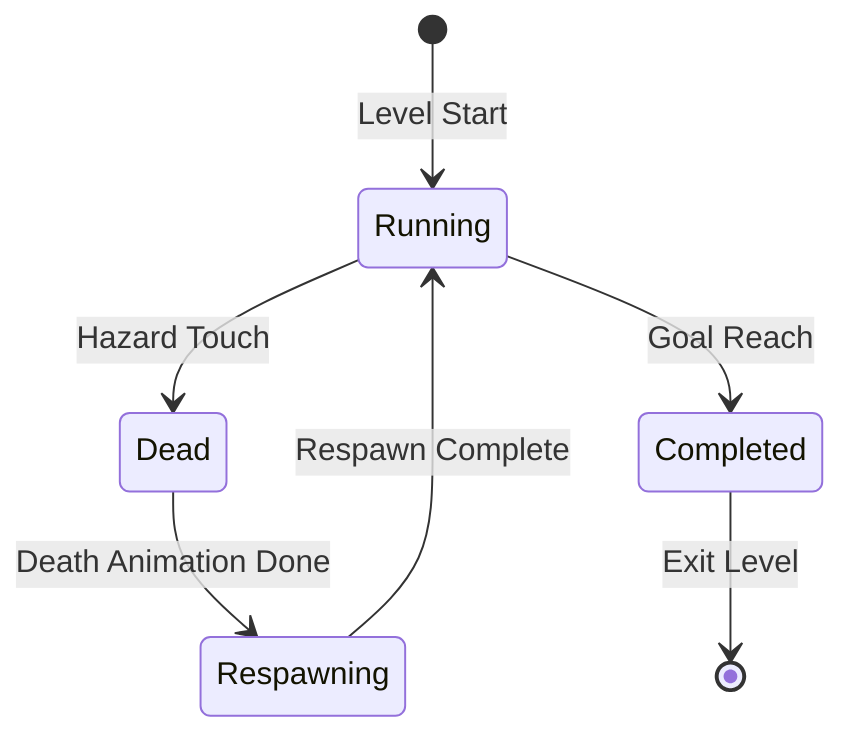

# Entity/Trigger Framework Architecture Design

## Overview

This document describes the architecture for an Entity/Trigger framework that enables interactive gameplay elements in the platformer. The framework supports hazards, checkpoints, switches, doors, and goals while integrating cleanly with the existing physics and world systems.

## Design Goals

1. **Minimal and Simple** - Avoid over-engineering; use straightforward patterns
2. **AABB-Based Triggers** - Leverage existing [`physics.AABB`](internal/physics/aabb.go:5) for overlap detection
3. **Clean Integration** - Work with existing [`physics.Body`](internal/physics/body.go:5), [`world.CollisionMap`](internal/world/collision.go:74), and scene structure
4. **Data-Driven** - Spawn entities from Tiled object layers

---

## 1. Entity Interface Design

### Core Interfaces

```go
// Entity is the base interface for all game entities.
// Entities are objects that exist in the world and can be updated/drawn.
type Entity interface {
    // Update called each frame with delta time
    Update(dt float64)
    
    // Draw renders the entity to screen with camera offset
    Draw(screen *ebiten.Image, camX, camY float64)
    
    // Bounds returns the entity's AABB for overlap queries
    Bounds() physics.AABB
}

// Trigger is an entity that responds to player overlap.
// Triggers do not have solid collision - they use AABB overlap tests.
type Trigger interface {
    Entity
    
    // OnEnter called when player enters the trigger zone
    OnEnter(player *physics.Body)
    
    // OnExit called when player exits the trigger zone  
    OnExit(player *physics.Body)
    
    // IsActive returns whether the trigger is currently active
    IsActive() bool
}

// SolidEntity is an entity with physics collision.
// These entities participate in tile collision resolution.
type SolidEntity interface {
    Entity
    
    // Body returns the physics body for collision resolution
    Body() *physics.Body
}
```

### Entity Types

| Type | Interface | Collision | Purpose |
|------|-----------|-----------|---------|
| Hazard | Trigger | None | Touch = death |
| Checkpoint | Trigger | None | Update respawn point |
| Goal | Trigger | None | Level complete |
| Switch | Trigger | None | Toggle door state |
| Door | SolidEntity | Solid when closed | Block/allow passage |
| Spawn | (internal) | None | Player start position |

### Entity Bounds vs Solid Collision

The framework distinguishes between:
- **Bounds** - The AABB used for trigger overlap queries (all entities)
- **Solid Collision** - Physics body that collides with tile grid (SolidEntity only)

Triggers use simple AABB overlap tests via [`AABB.Intersects()`](internal/physics/aabb.go:31), not tile collision.

---

## 2. Tiled Object Layer Import

### Object Format Specification

Tiled objects are defined in an object layer with the following conventions:

```json
{
  "type": "objectgroup",
  "name": "Entities",
  "objects": [
    {
      "id": 1,
      "name": "spawn_point",
      "type": "spawn",
      "x": 32,
      "y": 352,
      "width": 16,
      "height": 16
    },
    {
      "id": 2,
      "name": "spike_zone",
      "type": "hazard",
      "x": 160,
      "y": 352,
      "width": 48,
      "height": 8,
      "properties": [
        {"name": "damage", "type": "int", "value": 1}
      ]
    },
    {
      "id": 3,
      "name": "checkpoint_1",
      "type": "checkpoint",
      "x": 320,
      "y": 336,
      "width": 16,
      "height": 32,
      "properties": [
        {"name": "id", "type": "string", "value": "cp_1"}
      ]
    },
    {
      "id": 4,
      "name": "switch_door",
      "type": "switch",
      "x": 400,
      "y": 336,
      "width": 16,
      "height": 16,
      "properties": [
        {"name": "target", "type": "string", "value": "door_1"},
        {"name": "toggle", "type": "bool", "value": true}
      ]
    },
    {
      "id": 5,
      "name": "door_1",
      "type": "door",
      "x": 480,
      "y": 320,
      "width": 16,
      "height": 48,
      "properties": [
        {"name": "startOpen", "type": "bool", "value": false}
      ]
    },
    {
      "id": 6,
      "name": "level_end",
      "type": "goal",
      "x": 600,
      "y": 336,
      "width": 32,
      "height": 32
    }
  ]
}
```

### Object Type Definitions

| Type | Required Properties | Optional Properties |
|------|---------------------|-------------------|
| `spawn` | none | `default` (bool) |
| `hazard` | none | `damage` (int, default=1) |
| `checkpoint` | none | `id` (string), `order` (int) |
| `switch` | `target` (string) | `toggle` (bool), `once` (bool) |
| `door` | none | `startOpen` (bool), `id` (string) |
| `goal` | none | `nextLevel` (string) |

### Parsing Implementation

```go
// ObjectData represents a parsed Tiled object.
type ObjectData struct {
    ID       int
    Name     string
    Type     string
    X, Y     float64
    W, H     float64
    Props    map[string]any
}

// ParseObjectLayer extracts objects from a Tiled JSON object layer.
func ParseObjectLayer(layers []tiledLayer) []ObjectData {
    var objects []ObjectData
    for _, layer := range layers {
        if layer.Type != "objectgroup" {
            continue
        }
        for _, obj := range layer.Objects {
            data := ObjectData{
                ID:    obj.ID,
                Name:  obj.Name,
                Type:  obj.Type,
                X:     obj.X,
                Y:     obj.Y,
                W:     obj.Width,
                H:     obj.Height,
                Props: parseProperties(obj.Properties),
            }
            objects = append(objects, data)
        }
    }
    return objects
}
```

---

## 3. Gameplay State Machine

### State Diagram



### State Definitions

```go
// GameplayState represents the current game state.
type GameplayState int

const (
    StateRunning GameplayState = iota
    StateDead
    StateRespawning
    StateCompleted
)

// StateMachine manages gameplay state transitions.
type StateMachine struct {
    current      GameplayState
    respawnPoint physics.AABB
    deathTimer   float64    // Time since death
    respawnDelay float64    // Delay before respawn
}

// Update processes state transitions.
func (sm *StateMachine) Update(dt float64) {
    switch sm.current {
    case StateDead:
        sm.deathTimer += dt
        if sm.deathTimer >= sm.respawnDelay {
            sm.current = StateRespawning
        }
    case StateRespawning:
        // Respawn handled by scene
        sm.current = StateRunning
        sm.deathTimer = 0
    }
}

// TriggerDeath initiates death state.
func (sm *StateMachine) TriggerDeath() {
    if sm.current == StateRunning {
        sm.current = StateDead
        sm.deathTimer = 0
    }
}

// SetRespawnPoint updates the respawn location.
func (sm *StateMachine) SetRespawnPoint(x, y float64) {
    sm.respawnPoint = physics.AABB{X: x, Y: y, W: 16, H: 16}
}
```

### State Transition Rules

| From | To | Trigger | Action |
|------|-----|---------|--------|
| Running | Dead | Hazard overlap | Stop player, start timer |
| Dead | Respawning | Timer expires | Reset player position |
| Respawning | Running | Position reset | Restore control |
| Running | Completed | Goal overlap | Show victory, freeze |

---

## 4. Integration Points

### World Package Integration

The [`world.Map`](internal/world/map.go:247) and [`world.CollisionMap`](internal/world/collision.go:74) are extended to support entities:

```go
// EntityWorld holds the map, collision data, and entities.
type EntityWorld struct {
    tileMap      *world.Map
    collisionMap *world.CollisionMap
    entities     []Entity
    triggers     []Trigger
    solidEnts    []SolidEntity
    spawnPoint   physics.AABB
}

// NewEntityWorld creates a world from map data and spawns entities.
func NewEntityWorld(mapData *world.MapData, tileset *world.Tileset) *EntityWorld {
    w := &EntityWorld{
        tileMap:      world.NewMap(mapData, tileset),
        collisionMap: world.NewCollisionMapFromMap(mapData, "Collision"),
    }
    w.spawnEntities(mapData.Objects())
    return w
}

// Update updates all entities.
func (w *EntityWorld) Update(dt float64) {
    for _, e := range w.entities {
        e.Update(dt)
    }
}

// Draw renders all entities with camera offset.
func (w *EntityWorld) Draw(screen *ebiten.Image, camX, camY float64) {
    for _, e := range w.entities {
        e.Draw(screen, camX, camY)
    }
}

// CheckTriggers tests player against all triggers.
func (w *EntityWorld) CheckTriggers(player *physics.Body) {
    playerAABB := player.AABB()
    for _, t := range w.triggers {
        if !t.IsActive() {
            continue
        }
        if playerAABB.Intersects(t.Bounds()) {
            t.OnEnter(player)
        }
    }
}
```

### Physics Integration

Doors integrate with the existing collision system:

```go
// Door is a SolidEntity that can open/close.
type Door struct {
    body     *physics.Body
    isOpen   bool
    openAABB physics.AABB  // Empty when open
    closedAABB physics.AABB
}

// Body returns the physics body for collision.
func (d *Door) Body() *physics.Body {
    return d.body
}

// Open changes the door state.
func (d *Door) Open() {
    d.isOpen = true
    d.body.W = 0  // No collision when open
    d.body.H = 0
}

// Close changes the door state.
func (d *Door) Close() {
    d.isOpen = false
    d.body.W = d.closedAABB.W
    d.body.H = d.closedAABB.H
}
```

### Scene Integration

The sandbox scene is modified to use the entity system:

```go
// Scene now includes the entity world and state machine.
type Scene struct {
    // Existing fields...
    world    *EntityWorld
    state    *StateMachine
}

// FixedUpdate handles physics with entity collision.
func (s *Scene) FixedUpdate() error {
    if s.state.current != StateRunning {
        return nil  // Skip physics during death/respawn
    }
    
    // Existing physics update...
    s.playerController.FixedUpdate(...)
    
    // Check triggers after movement
    s.world.CheckTriggers(s.playerBody)
    
    return nil
}

// Update handles state machine.
func (s *Scene) Update(inp *input.Input) error {
    s.state.Update(1.0/60.0)
    
    // Handle respawn
    if s.state.current == StateRespawning {
        s.respawnPlayer()
    }
    
    // Existing update logic...
    return nil
}

// respawnPlayer resets player position.
func (s *Scene) respawnPlayer() {
    s.playerBody.PosX = s.state.respawnPoint.X
    s.playerBody.PosY = s.state.respawnPoint.Y
    s.playerBody.VelX = 0
    s.playerBody.VelY = 0
}
```

---

## 5. Entity Implementations

### Hazard

```go
// Hazard kills the player on touch.
type Hazard struct {
    bounds physics.AABB
    active bool
}

func NewHazard(x, y, w, h float64) *Hazard {
    return &Hazard{
        bounds: physics.AABB{X: x, Y: y, W: w, H: h},
        active: true,
    }
}

func (h *Hazard) Update(dt float64) {}

func (h *Hazard) Draw(screen *ebiten.Image, camX, camY float64) {
    // Optional: draw hazard indicator
}

func (h *Hazard) Bounds() physics.AABB { return h.bounds }

func (h *Hazard) OnEnter(player *physics.Body) {
    // Signal death through callback or event
    // The scene's state machine handles the actual death
}

func (h *Hazard) OnExit(player *physics.Body) {}

func (h *Hazard) IsActive() bool { return h.active }
```

### Checkpoint

```go
// Checkpoint updates the respawn point.
type Checkpoint struct {
    bounds   physics.AABB
    id       string
    active   bool
    triggered bool
    onActivate func(id string, x, y float64)  // Callback to scene
}

func (c *Checkpoint) OnEnter(player *physics.Body) {
    if !c.triggered {
        c.triggered = true
        c.onActivate(c.id, c.bounds.X, c.bounds.Y)
    }
}
```

### Switch + Door

```go
// Switch toggles door state on player touch.
type Switch struct {
    bounds     physics.AABB
    targetID   string
    toggleMode bool  // true = toggle, false = one-shot
    once       bool  // true = deactivate after use
    active     bool
    door       *Door  // Reference resolved after spawn
}

func (s *Switch) OnEnter(player *physics.Body) {
    if !s.active {
        return
    }
    if s.door == nil {
        return
    }
    
    if s.toggleMode {
        if s.door.IsOpen() {
            s.door.Close()
        } else {
            s.door.Open()
        }
    } else {
        s.door.Open()
    }
    
    if s.once {
        s.active = false
    }
}

// Door blocks passage when closed.
type Door struct {
    body       *physics.Body
    id         string
    isOpen     bool
    closedW    float64
    closedH    float64
}

func (d *Door) Update(dt float64) {}

func (d *Door) Draw(screen *ebiten.Image, camX, camY float64) {
    if d.isOpen {
        return  // Don't draw when open
    }
    // Draw door sprite/rect
}

func (d *Door) Bounds() physics.AABB {
    return d.body.AABB()
}

func (d *Door) Body() *physics.Body {
    return d.body
}

func (d *Door) IsOpen() bool { return d.isOpen }

func (d *Door) Open() {
    d.isOpen = true
    d.body.W = 0
    d.body.H = 0
}

func (d *Door) Close() {
    d.isOpen = false
    d.body.W = d.closedW
    d.body.H = d.closedH
}
```

### Goal

```go
// Goal triggers level completion.
type Goal struct {
    bounds    physics.AABB
    active    bool
    onComplete func()  // Callback to scene
}

func (g *Goal) OnEnter(player *physics.Body) {
    if g.active && g.onComplete != nil {
        g.onComplete()
        g.active = false
    }
}
```

---

## 6. Debug/Tooling

### Debug Visualization

```go
// DebugRenderer draws entity bounds and state info.
type DebugRenderer struct {
    showTriggers bool
    showBounds   bool
    showState    bool
}

func (d *DebugRenderer) Draw(screen *ebiten.Image, world *EntityWorld, state *StateMachine, camX, camY float64) {
    if d.showTriggers {
        d.drawTriggers(screen, world, camX, camY)
    }
    if d.showBounds {
        d.drawBounds(screen, world, camX, camY)
    }
    if d.showState {
        d.drawState(screen, state)
    }
}

func (d *DebugRenderer) drawTriggers(screen *ebiten.Image, world *EntityWorld, camX, camY float64) {
    triggerColor := color.RGBA{255, 255, 0, 100}  // Yellow semi-transparent
    for _, t := range world.triggers {
        if t.IsActive() {
            x := t.Bounds().X - camX
            y := t.Bounds().Y - camY
            ebitenutil.DrawRect(screen, x, y, t.Bounds().W, t.Bounds().H, triggerColor)
        }
    }
}

func (d *DebugRenderer) drawState(screen *ebiten.Image, state *StateMachine) {
    stateText := fmt.Sprintf("State: %s\nRespawn: (%.0f, %.0f)",
        stateNames[state.current],
        state.respawnPoint.X,
        state.respawnPoint.Y)
    ebitenutil.DebugPrintAt(screen, stateText, 10, 50)
}
```

### Debug Key Bindings

| Key | Action |
|-----|--------|
| F6 | Toggle trigger visualization |
| F7 | Toggle entity bounds |
| F8 | Toggle state display |
| R | Force respawn |

---

## 7. File Structure

```
internal/
  entities/
    entity.go       // Entity, Trigger, SolidEntity interfaces
    hazard.go       // Hazard implementation
    checkpoint.go   // Checkpoint implementation
    door.go         // Door implementation
    switch.go       // Switch implementation
    goal.go         // Goal implementation
    debug.go        // DebugRenderer

  world/
    objects.go      // ParseObjectLayer, ObjectData
    entity_world.go // EntityWorld container

  gameplay/
    state.go        // StateMachine, GameplayState
    callbacks.go    // Event callbacks for entities

  scenes/
    sandbox/
      scene.go      // Modified to use EntityWorld, StateMachine
```

---

## 8. Implementation Order

1. **Core Interfaces** - [`entities/entity.go`](internal/entities/entity.go) with Entity, Trigger, SolidEntity
2. **State Machine** - [`gameplay/state.go`](internal/gameplay/state.go) with basic Running/Dead/Respawning
3. **Object Parsing** - [`world/objects.go`](internal/world/objects.go) to extract Tiled objects
4. **EntityWorld** - [`world/entity_world.go`](internal/world/entity_world.go) container
5. **Hazard Entity** - [`entities/hazard.go`](internal/entities/hazard.go) for death trigger
6. **Scene Integration** - Modify [`scenes/sandbox/scene.go`](internal/scenes/sandbox/scene.go) to use state machine
7. **Checkpoint Entity** - [`entities/checkpoint.go`](internal/entities/checkpoint.go)
8. **Goal Entity** - [`entities/goal.go`](internal/entities/goal.go)
9. **Switch + Door** - [`entities/switch.go`](internal/entities/switch.go) and [`entities/door.go`](internal/entities/door.go)
10. **Debug Tools** - [`entities/debug.go`](internal/entities/debug.go)

---

## 9. Assumptions and Trade-offs

### Assumptions

1. **Single Player** - Only one player body exists for trigger checks
2. **Frame-Based Triggers** - Triggers check overlap each frame (no continuous collision detection)
3. **Simple State** - No save/load system; state is per-level
4. **Tiled JSON Format** - Using standard Tiled JSON export format

### Trade-offs

| Decision | Benefit | Cost |
|----------|---------|------|
| AABB overlap for triggers | Simple, fast, uses existing code | Can miss fast-moving objects |
| Callback-based events | Decoupled entities | Manual wiring in scene |
| No entity-component system | Simpler code | Less flexible composition |
| Door as SolidEntity | Integrates with physics | Requires special collision handling |

### Future Considerations

- **Entity Pooling** - For many similar entities (projectiles, particles)
- **Event Bus** - For more complex entity interactions
- **Save State** - Persist checkpoint progress
- **Moving Platforms** - Extend SolidEntity with velocity