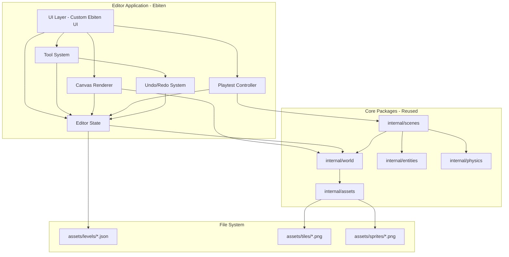

# Level Editor Design Document

## Executive Summary

This document outlines the architectural plan for building a level editor for the GoP (Go Platformer) game. The editor will enable designers to create and modify game levels through a visual interface, placing tiles, entities, and configuring their properties while maintaining compatibility with the existing Tiled JSON format.

### Key Recommendations

1. **Standalone Desktop Application** - Build using Ebiten for seamless playtest integration
2. **Tiled JSON Compatibility** - Maintain full read/write compatibility with existing level format
3. **Visual Entity Placement** - Drag-and-drop interface for all entity types with property editing
4. **Integrated Playtest Mode** - Test levels directly in the editor using the game's scene system
5. **Modular Architecture** - Reuse existing `internal/world` and `internal/entities` packages

---

## Decisions Made

The following key decisions have been made for the level editor implementation:

| Decision | Choice | Rationale |
|----------|--------|-----------|
| **UI Framework** | Ebiten | Allows seamless playtest integration by reusing the existing game rendering pipeline. Since playtest mode is a priority feature, using the same framework as the game enables direct code reuse for scene rendering, entity systems, and physics. |
| **Playtest Mode** | Priority Feature | Included in Phase 2. This is essential for rapid level design iteration, allowing designers to test their creations without leaving the editor. |
| **Multi-Level Support** | Not Needed | Deferred indefinitely. The project is not at a stage where world maps or level packs are needed. Focus remains on single-level editing. |
| **Tileset Editing** | Not Needed | Deferred indefinitely. The existing tileset is sufficient for current needs. This can be revisited if asset creation becomes a bottleneck. |

---

## Current State Analysis

### Level Format

The game uses Tiled-compatible JSON format stored in [`assets/levels/`](assets/levels/). The structure includes:

```
Level JSON Structure:
{
  "width": 80,           // Map width in tiles
  "height": 25,          // Map height in tiles
  "tilewidth": 16,       // Tile width in pixels
  "tileheight": 16,      // Tile height in pixels
  "layers": [
    {
      "name": "Tiles",       // Visual tile layer
      "type": "tilelayer",
      "data": [1, 0, 0, ...] // Tile IDs (global IDs)
    },
    {
      "name": "Collision",   // Collision tile layer
      "type": "tilelayer",
      "data": [1, 0, 0, ...] // Non-zero = solid
    },
    {
      "name": "Objects",     // Entity placements
      "type": "objectgroup",
      "objects": [...]
    }
  ],
  "tilesets": [...]      // Tileset definitions
}
```

### Entity Types and Properties

Based on analysis of [`internal/entities/`](internal/entities/) and [`internal/world/objects.go`](internal/world/objects.go:9), the following entity types are supported:

| Type | Object Type | Required Properties | Optional Properties |
|------|-------------|---------------------|---------------------|
| **PlayerSpawn** | `spawn` | x, y, width, height | - |
| **Platform** | `platform` | x, y, width, height | id, endX, endY, speed, waitTime, pushPlayer |
| **Switch** | `switch` | x, y, width, height | door_id, toggle, once |
| **Door** | `door` | x, y, width, height | id, startOpen |
| **Hazard** | `hazard` | x, y, width, height | - |
| **Checkpoint** | `checkpoint` | x, y, width, height | id |
| **Goal** | `goal` | x, y, width, height | - |

### Property Types

From [`internal/world/objects.go`](internal/world/objects.go:31-72), properties support:
- `string` - Entity IDs, target references
- `float` - Positions, speeds, timings
- `bool` - Toggle flags, state options

### Map System Architecture

The map loading pipeline from [`internal/world/map.go`](internal/world/map.go):

```
Tiled JSON --> ParseTiledJSON() --> MapData --> NewMap() --> Map
                                          |
                                          v
                                    TileLayer[] (Tiles, Collision)
                                          
Tiled JSON --> ParseObjects() --> []ObjectData --> Entity Spawning
```

Key structures:
- [`Tileset`](internal/world/map.go:13) - Tile image collection with slicing
- [`TileLayer`](internal/world/map.go:81) - 2D tile ID storage
- [`Map`](internal/world/map.go:248) - Complete tilemap with layers
- [`ObjectData`](internal/world/objects.go:22) - Parsed entity definition

### Asset Pipeline

From [`internal/assets/`](internal/assets/):
- [`assets.go`](internal/assets/assets.go) - Filesystem access to `assets/` directory
- [`sheet.go`](internal/assets/sheet.go) - Spritesheet frame extraction
- [`images.go`](internal/assets/images.go) - Image loading utilities

Tileset: `assets/tiles/tiles.png` (128x128, 8x8 tiles of 16x16 pixels)
Sprites: `assets/sprites/test_sheet.png` (animation test spritesheet)

### Existing Tooling Patterns

From [`cmd/`](cmd/):

1. **[`gensheet`](cmd/gensheet/main.go)** - Generates test spritesheets
   - Creates PNG files programmatically
   - Uses `image` and `image/png` packages
   - Output to `assets/sprites/`

2. **[`gentiles`](cmd/gentiles/main.go)** - Generates tileset images
   - Creates tileset PNG with various tile types
   - Demonstrates tile drawing patterns
   - Output to `assets/tiles/`

3. **[`verify_objects`](cmd/verify_objects/main.go)** - Validates object parsing
   - Reads level JSON
   - Uses `world.ParseObjects()` for validation
   - Reports object counts by type

---

## Editor Features

### Core Features (Phase 1)

#### 1. Tile Editing
- **Tile Palette** - Visual selection from loaded tileset
- **Paint Mode** - Click/drag to place tiles on active layer
- **Erase Mode** - Remove tiles (set to 0)
- **Fill Mode** - Flood fill contiguous empty/same areas
- **Layer Selection** - Switch between Tiles and Collision layers
- **Collision Overlay** - Visual indicator of solid tiles

#### 2. Object Placement
- **Entity Palette** - Icons for each entity type
- **Place Mode** - Click to place new entities
- **Select Mode** - Click to select existing entities
- **Move Mode** - Drag to reposition selected entities
- **Resize Handles** - Adjust entity dimensions
- **Delete** - Remove selected entities

#### 3. Property Editing
- **Property Panel** - Context-sensitive property display
- **Type Validation** - Enforce correct property types
- **ID Validation** - Check for duplicate IDs
- **Reference Validation** - Verify target references exist (e.g., switch -> door)

#### 4. File Operations
- **New Level** - Create empty level with dimensions
- **Open Level** - Load existing Tiled JSON
- **Save Level** - Export to Tiled JSON format
- **Save As** - Save to new file
- **Recent Files** - Quick access to recent levels

### Extended Features (Phase 2)

#### 5. Advanced Editing
- **Undo/Redo** - History stack for all operations
- **Copy/Paste** - Duplicate tile regions and entities
- **Multi-Select** - Select multiple entities
- **Snap to Grid** - Align entities to tile boundaries
- **Zoom/Pan** - Navigate large levels

#### 6. Visual Enhancements
- **Grid Overlay** - Toggle tile grid visibility
- **Entity Icons** - Distinct visual representations
- **Platform Path Preview** - Show movement paths
- **Switch/Door Links** - Visual connection lines
- **Playtest Preview** - Quick in-editor test mode

#### 7. Quality of Life
- **Keyboard Shortcuts** - Common actions
- **Minimap** - Level overview navigation
- **Layer Visibility** - Toggle layer rendering
- **Entity Search** - Find by name or ID
- **Property Presets** - Save/load common configurations

---

## Playtest Mode

Playtest mode is a priority feature that allows designers to test their levels without leaving the editor. This is essential for rapid iteration during level design.

### Overview

The playtest system embeds the game's scene system directly within the editor, allowing instant transitions between editing and testing modes.

### Architecture

```
+-------------------+     Playtest      +-------------------+
|   Editor Mode     | <-------------->  |   Playtest Mode   |
+-------------------+                   +-------------------+
| - Canvas rendering|                   | - Game scene      |
| - Tool handling   |                   | - Player control  |
| - UI panels       |                   | - Physics sim     |
+-------------------+                   +-------------------+
         |                                       |
         v                                       v
+-------------------+                   +-------------------+
|  Editor State     |                   |  Game State       |
|  (persistent)     |                   |  (temporary)      |
+-------------------+                   +-------------------+
```

### Implementation Details

#### 1. Scene System Embedding

The editor will reuse the existing scene infrastructure from [`internal/scenes/sandbox/`](internal/scenes/sandbox/):

```go
// internal/editor/playtest.go
type PlaytestController struct {
    editor      *Editor
    scene       *sandbox.Scene
    savedState  *EditorSnapshot  // State before playtest
    isActive    bool
}

func (p *PlaytestController) StartPlaytest() {
    // 1. Save current editor state
    p.savedState = p.editor.CreateSnapshot()
    
    // 2. Build game map from editor data
    mapData := p.editor.BuildMapData()
    
    // 3. Create game scene with editor's level
    p.scene = sandbox.NewSceneWithMap(mapData)
    
    // 4. Transition to playtest mode
    p.isActive = true
}

func (p *PlaytestController) EndPlaytest() {
    // 1. Clean up game scene
    p.scene = nil
    
    // 2. Restore editor state from snapshot
    p.editor.RestoreSnapshot(p.savedState)
    
    // 3. Return to edit mode
    p.isActive = false
}
```

#### 2. Editor → Playtest Transition

When entering playtest mode:

1. **Snapshot Creation** - Save all editor state (camera position, selection, undo history)
2. **Map Serialization** - Convert editor state to `world.MapData` format
3. **Scene Initialization** - Create game scene with the level data
4. **Input Handoff** - Switch input handling from editor tools to player controls

```go
type EditorSnapshot struct {
    CameraX, CameraY float64
    Zoom             float64
    SelectedTool     Tool
    SelectedObject   int
    SelectedTile     int
    History          *History  // Preserve undo stack
}

func (e *Editor) CreateSnapshot() *EditorSnapshot {
    return &EditorSnapshot{
        CameraX:       e.camera.X,
        CameraY:       e.camera.Y,
        Zoom:          e.camera.Zoom,
        SelectedTool:  e.currentTool,
        SelectedObject: e.selectedObject,
        SelectedTile:  e.selectedTile,
        History:       e.history,
    }
}
```

#### 3. Playtest → Editor Transition

When exiting playtest mode:

1. **Scene Cleanup** - Release game scene resources
2. **State Restoration** - Restore camera, selection, and UI state
3. **Map Reload** - Rebuild editor representation from saved state
4. **Input Return** - Switch input back to editor tools

#### 4. State Reset Strategy

The key challenge is ensuring clean state when returning to the editor:

```go
func (p *PlaytestController) EndPlaytest() {
    // Critical: Discard any runtime game state
    // The editor's level data should NOT be modified by playtest
    
    // Restore from snapshot (level data unchanged)
    p.editor.RestoreSnapshot(p.savedState)
    
    // Force garbage collection to clean up game entities
    runtime.GC()
}
```

### User Experience

1. **Enter Playtest** - Press `P` key or click Play button
2. **Play the Level** - Full game controls active
3. **Exit Playtest** - Press `Escape` to return to editor
4. **Quick Restart** - Press `R` during playtest to restart from beginning

### Integration Points

| Component | Editor Use | Playtest Use |
|-----------|------------|--------------|
| [`internal/world/map.go`](internal/world/map.go) | Read/write level data | Read-only for rendering |
| [`internal/entities/`](internal/entities/) | Property schemas, preview | Full entity simulation |
| [`internal/physics/`](internal/physics/) | Collision overlay | Full physics simulation |
| [`internal/input/`](internal/input/input.go) | Tool shortcuts | Player movement |
| [`internal/camera/`](internal/camera/camera.go) | Pan/zoom controls | Follow player |

---

## Technical Architecture

### Application Structure

```
cmd/
  editor/
    main.go           # Entry point
    
internal/
  editor/
    app.go           # Editor application (Ebiten/Game interface)
    canvas.go        # Tilemap rendering and interaction
    palette.go       # Tile/entity selection UI
    properties.go    # Property editing panel
    toolbar.go       # Main toolbar
    menubar.go       # Menu bar
    dialogs.go       # File dialogs, confirmations
    history.go       # Undo/redo system
    selection.go     # Selection management
    tools.go         # Tool implementations (paint, select, etc.)
    
  editor/ui/         # UI components (if using custom rendering)
    button.go
    panel.go
    scroll.go
    input.go
    
  editor/actions/    # Edit actions for undo/redo
    action.go        # Action interface
    tile_action.go   # Tile modifications
    object_action.go # Object modifications
```

### UI Framework Decision: Ebiten

**Chosen Framework:** Ebiten + Custom UI

The editor will be built using Ebiten, the same framework used by the game. This decision enables:

1. **Seamless Playtest Integration** - Direct reuse of the game's scene system, rendering pipeline, and entity logic
2. **Code Reuse** - Share rendering code, camera systems, and entity definitions between editor and game
3. **No New Dependencies** - The project already uses Ebiten; no additional libraries needed
4. **Consistent Rendering** - What you see in the editor matches exactly what the game renders

**Trade-offs Accepted:**
- Custom UI components must be built from scratch
- More development time for UI elements
- No native OS widgets

**Implementation:**
```go
// cmd/editor/main.go
package main

import (
    "github.com/hajimehoshi/ebiten/v2"
)

type Editor struct {
    state     *EditorState
    canvas    *Canvas
    palette   *Palette
    properties *PropertiesPanel
    toolbar   *Toolbar
}

func (e *Editor) Update() error {
    // Handle input, update UI state
    return nil
}

func (e *Editor) Draw(screen *ebiten.Image) {
    // Render canvas, UI panels, overlays
}

func (e *Editor) Layout(outsideWidth, outsideHeight int) (int, int) {
    return outsideWidth, outsideHeight
}

func main() {
    editor := NewEditor()
    ebiten.SetWindowSize(1280, 720)
    ebiten.SetWindowTitle("GoP Level Editor")
    ebiten.RunGame(editor)
}
```

#### Alternative Frameworks Considered

| Framework | Pros | Cons | Why Not Chosen |
|-----------|------|------|----------------|
| **Fyne** | Native widgets, rapid development | Custom canvas difficult, separate rendering context | Cannot easily embed game's Ebiten renderer for playtest |
| **Gio** | Immediate mode, high performance | Steeper learning curve, separate rendering | Same issue - playtest integration would be complex |

### Data Flow

```
+------------------------+
|     Editor State       |
+------------------------+
| currentFile: string    |
| mapData: *world.MapData|
| objects: []ObjectData  |
| selectedTool: Tool     |
| selectedLayer: string  |
| selectedObject: int    |
| history: *History      |
+------------------------+
           |
           | Read/Write
           v
+------------------------+
|    File System         |
+------------------------+
| assets/levels/*.json   |
+------------------------+
```

### State Management

```go
// internal/editor/state.go
type EditorState struct {
    // Level data
    FilePath   string
    MapData    *world.MapData
    Objects    []world.ObjectData
    Tileset    *world.Tileset
    
    // UI state
    CurrentTool    Tool
    CurrentLayer   string  // "Tiles" or "Collision"
    SelectedTile   int     // Tile ID for painting
    SelectedObject int     // Object index, -1 if none
    
    // View state
    CameraX, CameraY float64
    Zoom             float64
    
    // History
    History *History
}

// Tool types
type Tool int
const (
    ToolSelect Tool = iota
    ToolPaint
    ToolErase
    ToolFill
    ToolPlaceObject
)
```

### Undo/Redo System

```go
// internal/editor/history.go
type Action interface {
    Do(state *EditorState)      // Apply the action
    Undo(state *EditorState)    // Reverse the action
    Description() string       // For UI display
}

type History struct {
    actions []Action
    index   int  // Current position in history
}

func (h *History) Do(action Action, state *EditorState) {
    // Truncate future history if we're not at the end
    h.actions = h.actions[:h.index]
    
    action.Do(state)
    h.actions = append(h.actions, action)
    h.index++
}

func (h *History) Undo(state *EditorState) bool {
    if h.index == 0 {
        return false
    }
    h.index--
    h.actions[h.index].Undo(state)
    return true
}

func (h *History) Redo(state *EditorState) bool {
    if h.index >= len(h.actions) {
        return false
    }
    h.actions[h.index].Do(state)
    h.index++
    return true
}
```

### Action Implementations

```go
// internal/editor/actions/tile_action.go
type PaintTileAction struct {
    LayerName string
    TileX, TileY int
    OldTileID, NewTileID int
}

func (a *PaintTileAction) Do(state *EditorState) {
    layer := state.MapData.Layer(a.LayerName)
    layer.SetTile(a.TileX, a.TileY, a.NewTileID)
}

func (a *PaintTileAction) Undo(state *EditorState) {
    layer := state.MapData.Layer(a.LayerName)
    layer.SetTile(a.TileX, a.TileY, a.OldTileID)
}

// internal/editor/actions/object_action.go
type MoveObjectAction struct {
    ObjectIndex int
    OldX, OldY float64
    NewX, NewY float64
}

func (a *MoveObjectAction) Do(state *EditorState) {
    state.Objects[a.ObjectIndex].X = a.NewX
    state.Objects[a.ObjectIndex].Y = a.NewY
}

func (a *MoveObjectAction) Undo(state *EditorState) {
    state.Objects[a.ObjectIndex].X = a.OldX
    state.Objects[a.ObjectIndex].Y = a.OldY
}
```

### Canvas Rendering

The canvas needs to render the tilemap with camera controls:

```go
// internal/editor/canvas.go
type Canvas struct {
    state *EditorState
    
    // Interaction state
    isDragging    bool
    dragStartX, dragStartY float64
    dragButton    int
}

func (c *Canvas) Draw(screen *ebiten.Image) {
    // 1. Draw tile layers
    for _, layer := range c.state.MapData.Layers() {
        c.drawLayer(screen, layer)
    }
    
    // 2. Draw objects
    for i, obj := range c.state.Objects {
        c.drawObject(screen, obj, i == c.state.SelectedObject)
    }
    
    // 3. Draw overlays (grid, selection, etc.)
    if c.state.ShowGrid {
        c.drawGrid(screen)
    }
    
    // 4. Draw tool preview
    c.drawToolPreview(screen)
}
```

### Object Property Schema

Define property schemas for validation and UI generation:

```go
// internal/editor/schema.go
type PropertySchema struct {
    Name     string
    Type     string  // "string", "float", "bool"
    Required bool
    Default  any
    Min      float64 // For float types
    Max      float64 // For float types
}

type ObjectSchema struct {
    Type       string
    Name       string
    Icon       string  // Icon identifier
    DefaultW   float64
    DefaultH   float64
    Properties []PropertySchema
}

var ObjectSchemas = map[string]ObjectSchema{
    "spawn": {
        Type:     "spawn",
        Name:     "Player Spawn",
        Icon:     "spawn",
        DefaultW: 32,
        DefaultH: 32,
        Properties: []PropertySchema{},
    },
    "platform": {
        Type:     "platform",
        Name:     "Moving Platform",
        Icon:     "platform",
        DefaultW: 64,
        DefaultH: 16,
        Properties: []PropertySchema{
            {Name: "id", Type: "string", Required: true},
            {Name: "endX", Type: "float", Required: true},
            {Name: "endY", Type: "float", Required: true},
            {Name: "speed", Type: "float", Default: 60.0, Min: 0, Max: 500},
            {Name: "waitTime", Type: "float", Default: 0.5, Min: 0, Max: 10},
            {Name: "pushPlayer", Type: "bool", Default: false},
        },
    },
    "switch": {
        Type:     "switch",
        Name:     "Switch",
        Icon:     "switch",
        DefaultW: 32,
        DefaultH: 16,
        Properties: []PropertySchema{
            {Name: "door_id", Type: "string", Required: true},
            {Name: "toggle", Type: "bool", Default: true},
            {Name: "once", Type: "bool", Default: false},
        },
    },
    // ... other types
}
```

---

## Implementation Phases

### Phase 1: Foundation

**Goal:** Basic tile editing with file operations using Ebiten

1. **Project Setup**
   - Create `cmd/editor/main.go` with Ebiten application structure
   - Create `internal/editor/` package skeleton
   - Set up basic game loop with editor mode

2. **File Operations**
   - Implement new level creation
   - Implement Tiled JSON loading
   - Implement Tiled JSON saving
   - Add recent files tracking

3. **Tile Canvas**
   - Render tilemap from MapData using existing world rendering
   - Implement camera pan/zoom (reuse camera system)
   - Add tile selection from palette
   - Implement paint and erase tools

4. **Layer Support**
   - Layer selection UI
   - Layer visibility toggles
   - Collision layer overlay

### Phase 2: Object Editing & Playtest

**Goal:** Full entity placement, property editing, and playtest capability

1. **Object Palette**
   - Entity type icons
   - Object placement tool
   - Default sizes per type

2. **Object Selection**
   - Click to select
   - Drag to move
   - Resize handles
   - Delete operation

3. **Property Panel**
   - Dynamic form generation from schema
   - Type validation
   - Change tracking

4. **Validation**
   - ID uniqueness checking
   - Reference validation (switch -> door)
   - Visual error indicators

5. **Playtest Mode**
   - Implement PlaytestController
   - Editor state snapshot/restore
   - Scene system integration
   - Input mode switching
   - Quick restart functionality

### Phase 3: Polish

**Goal:** Production-ready editor with quality-of-life features

1. **Undo/Redo**
   - Implement action system
   - Track all modifications
   - Keyboard shortcuts

2. **Advanced Tools**
   - Flood fill
   - Multi-select
   - Copy/paste

3. **Visual Enhancements**
   - Platform path preview
   - Switch/door link lines
   - Entity icons in canvas

4. **Quality of Life**
   - Keyboard shortcuts
   - Minimap
   - Search functionality

---

## File Format Considerations

### Current Format Compatibility

The editor must maintain 100% read/write compatibility with the existing Tiled JSON format. Key considerations:

1. **Layer Order** - Preserve layer order in JSON
2. **Property Types** - Match Tiled's property type system
3. **Global Tile IDs** - Handle tileset references correctly
4. **Object IDs** - Maintain unique object IDs

### Potential Enhancements

While maintaining compatibility, consider:

1. **Editor Metadata** - Store editor-specific data in custom properties
   ```json
   {
     "name": "editor_metadata",
     "type": "editor",
     "value": {
       "lastCameraX": 500,
       "lastCameraY": 300,
       "lastZoom": 1.0
     }
   }
   ```

2. **Entity Templates** - Allow saving entity configurations as templates
   ```json
   {
     "name": "platform_fast",
     "type": "platform",
     "template": {
       "speed": 120,
       "waitTime": 0.3
     }
   }
   ```

3. **Level Metadata** - Add level properties
   ```json
   {
     "properties": [
       {"name": "level_name", "type": "string", "value": "Level 1"},
       {"name": "difficulty", "type": "int", "value": 1}
     ]
   }
   ```

---

## Integration Points

### Asset Pipeline Integration

The editor should integrate with the existing asset system:

```
Editor                    Game
   |                        |
   v                        v
assets/tiles/tiles.png --> internal/assets
assets/sprites/*.png   --> internal/assets
assets/levels/*.json   --> internal/world
```

**Integration Tasks:**
1. Use [`internal/assets.FS()`](internal/assets/assets.go:15) for asset loading
2. Reuse [`world.NewTilesetFromImage()`](internal/world/map.go:23) for tileset rendering
3. Share tileset image path resolution with game

### Entity System Integration

Reuse entity definitions for validation and preview:

```go
// Use entity constructors for default values
platform := entities.NewMovingPlatform("", 0, 0, 64, 16, 0, 0, 60)
// Extract default property values from constructed entity
```

### Validation Integration

Use [`cmd/verify_objects`](cmd/verify_objects/main.go) patterns for validation:

```go
// internal/editor/validation.go
func ValidateLevel(state *EditorState) []error {
    var errors []error
    
    // Check spawn exists
    spawns := world.FilterObjectsByType(state.Objects, world.ObjectTypeSpawn)
    if len(spawns) == 0 {
        errors = append(errors, fmt.Errorf("no player spawn point defined"))
    }
    
    // Check ID uniqueness
    ids := make(map[string]int)
    for _, obj := range state.Objects {
        if id := obj.GetPropString("id", ""); id != "" {
            if _, exists := ids[id]; exists {
                errors = append(errors, fmt.Errorf("duplicate ID: %s", id))
            }
            ids[id] = obj.ID
        }
    }
    
    // Check switch references
    for _, obj := range state.Objects {
        if obj.Type == world.ObjectTypeSwitch {
            targetID := obj.GetPropString("door_id", "")
            if _, exists := ids[targetID]; !exists {
                errors = append(errors, fmt.Errorf("switch references unknown door: %s", targetID))
            }
        }
    }
    
    return errors
}
```

---

## Open Questions

### Technical Decisions

1. **Canvas Rendering Approach**
   - How to structure the canvas rendering pipeline?
   - Should we use a separate render target for the canvas?
    
    **Recommendation:** Use Ebiten's `ebiten.NewImage()` for off-screen canvas rendering, then draw to screen with camera transform.

2. **Property Editing UI**
   - Auto-generate from schema?
   - Custom forms per entity type?
   - Property grid like Visual Studio?
    
    **Recommendation:** Auto-generate from schema with custom editors for complex types (e.g., path points).

### Workflow Questions

3. **Default Entity Sizes**
   - Use current defaults from entity constructors?
   - Allow customization?
    
    **Recommendation:** Use entity constructor defaults, allow user customization in Phase 3.

4. **Grid Snapping**
   - Always snap to tile grid?
   - Allow free placement?
   - Configurable snap settings?
    
    **Recommendation:** Default to tile snapping, allow toggle for free placement.

---

## Architecture Diagram



---

## Summary

This design document outlines a comprehensive plan for building a level editor for the GoP game. The key decisions are:

1. **Build using Ebiten** - Same framework as the game, enabling seamless playtest integration
2. **Maintain Tiled JSON compatibility** for seamless integration with the existing game
3. **Include playtest mode in Phase 2** - Priority feature for rapid level design iteration
4. **Reuse existing packages** (`internal/world`, `internal/assets`, `internal/entities`) for data handling
5. **Implement in three phases** - Foundation, Object Editing & Playtest, Polish
6. **Use a schema-driven approach** for entity property editing and validation

### Out of Scope

The following features are explicitly deferred and not part of the current plan:
- Multi-level/world map support
- Tileset editing capabilities

The editor will significantly improve the level design workflow while maintaining compatibility with the existing game architecture.