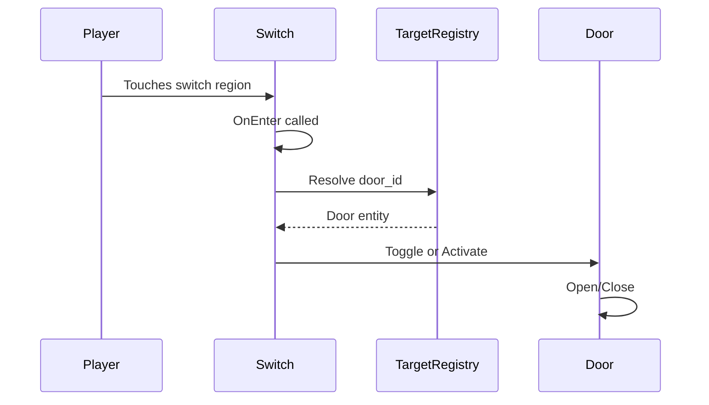
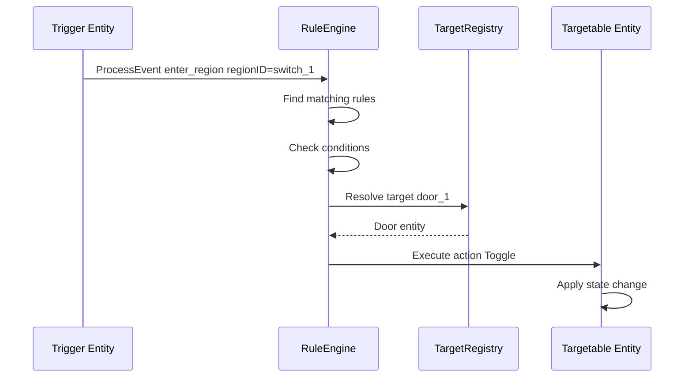

# Rules System Design Document

## Overview

This document describes the design for a minimal rule/scripting system (MVP) for the GoP game. The system replaces hardcoded entity interactions (e.g., "Switch touched → Door opens") with a data-driven rule system that can be configured via YAML/JSON files.

### Goals

1. **Data-Driven**: Rules defined in YAML/JSON, not code
2. **Minimal**: MVP scope - no UI, no Lua, just declarative rules
3. **Extensible**: Easy to add new event types and actions
4. **Compatible**: Works with existing `TargetRegistry` pattern

### Non-Goals

- Visual rule editor
- Lua or other scripting language integration
- Complex condition logic (AND/OR/NOT combinations)
- State variables or counters (future enhancement)

## Current Architecture Analysis

### Existing Patterns

The codebase already has a well-designed entity interaction system:

#### Targetable Interface

Located at [`internal/entities/targetable.go`](internal/entities/targetable.go:1):

```go
type Targetable interface {
    Activate()     // Trigger the target (e.g., open door)
    Deactivate()   // Untrigger the target (e.g., close door)
    Toggle()       // Flip the state
    TargetID() string
}
```

#### TargetRegistry

A simple ID-to-target lookup:

```go
type TargetRegistry struct {
    targets map[string]Targetable
}
```

Key methods: `Register()`, `Resolve()`, `HasTarget()`

#### Current Switch → Door Flow



### Problem with Current Approach

The Switch entity has hardcoded behavior:
- Only supports single target
- Toggle vs Activate logic is in Switch code
- Adding new trigger types requires code changes

## Proposed Architecture

### Package Structure

```
internal/rules/
├── engine.go       # RuleEngine - main entry point
├── event.go        # Event types and dispatcher
├── rule.go         # Rule, RuleSet, WhenClause, ActionSpec
├── actions.go      # Action execution logic
├── loader.go       # YAML/JSON loading
└── context.go      # ActionContext for execution
```

### Core Types

#### Event

An Event represents something that happened in the game:

```go
// EventType defines the type of game event.
type EventType string

// MVP event types.
const (
    // EventEnterRegion is emitted when a player enters a trigger region
    EventEnterRegion EventType = "enter_region"
    // EventExitRegion is emitted when a player exits a trigger region
    EventExitRegion EventType = "exit_region"
)

// Event represents a game event that can trigger rules.
type Event struct {
    Type      EventType // Event type: "enter_region" or "exit_region"
    RegionID  string    // Region/trigger ID (e.g., "switch_A")
    ActorType string    // Actor type: "player", "enemy", etc. (MVP: only "player")
}
```

#### Rule and RuleSet

```go
// WhenClause defines when a rule should trigger.
type WhenClause struct {
    Event  EventType `yaml:"event"`            // Event type to match
    Region string    `yaml:"region,omitempty"` // Optional: region/trigger ID to match
    Actor  string    `yaml:"actor,omitempty"`  // Optional: actor type to match ("player", "enemy")
}

// ActionSpec defines an action to execute when a rule triggers.
type ActionSpec struct {
    Type   string         `yaml:"type"`            // Action type: activate, deactivate, toggle
    Target string         `yaml:"target"`          // Target entity ID
    Params map[string]any `yaml:"params,omitempty"` // Optional parameters
}

// Rule is a single rule definition.
type Rule struct {
    ID      string       `yaml:"id"`
    When    WhenClause   `yaml:"when"`
    Actions []ActionSpec `yaml:"actions"`
    Once    bool         `yaml:"once,omitempty"`   // If true, rule fires only once
    Active  bool         `yaml:"active,omitempty"` // Rule enabled/disabled (default: true)
}

// RuleSet is a collection of rules loaded from a file.
type RuleSet struct {
    Rules []Rule `yaml:"rules"`
}
```

#### ActionContext

```go
// ActionContext provides context for action execution.
type ActionContext struct {
    Event    Event          // The event that triggered this action
    Resolver TargetResolver // Used to look up target entities
    Logf     func(format string, args ...any) // Optional logging function
}

// TargetResolver is a minimal interface for the registry.
// This matches the existing TargetRegistry.Resolve method.
type TargetResolver interface {
    Resolve(id string) Targetable
}
```

#### RuleEngine

```go
// RuleEngine processes events and executes matching rules
type RuleEngine struct {
    rules    []Rule
    resolver TargetResolver
    fired    map[string]bool // Track once rules
}

// ProcessEvent checks all rules against the event
func (e *RuleEngine) ProcessEvent(event Event)

// LoadRules loads rules from YAML data
func (e *RuleEngine) LoadRules(data []byte) error
```

### Event Flow



### YAML Rule Format

```yaml
rules:
  # Simple switch → door toggle
  - id: switch_1_opens_door_1
    when:
      event: enter_region
      region: switch_1
    actions:
      - type: toggle
        target: door_1

  # Multiple actions from one trigger
  - id: master_switch_opens_all
    when:
      event: enter_region
      region: master_switch
    actions:
      - type: activate
        target: door_1
      - type: activate
        target: door_2
      - type: activate
        target: door_3

  # One-shot rule
  - id: secret_door_once
    when:
      event: enter_region
      region: secret_trigger
    actions:
      - type: activate
        target: secret_door
    once: true

  # Exit trigger
  - id: close_on_exit
    when:
      event: exit_region
      region: pressure_plate
    actions:
      - type: deactivate
        target: door_1

  # Actor-specific rule (future: enemy triggers)
  - id: player_only_trigger
    when:
      event: enter_region
      region: special_switch
      actor: player
    actions:
      - type: activate
        target: special_door
```

## Integration Plan

### Phase 1: Core Implementation

1. Create `internal/rules/` package with core types
2. Implement `RuleEngine` with `ProcessEvent`
3. Implement action execution using `TargetResolver`
4. Add YAML loading support

### Phase 2: Trigger Integration

Modify existing triggers to emit events:

#### Option A: Event Emitter Pattern

Add an `EventEmitter` interface that triggers can use:

```go
// EventEmitter is implemented by the scene or entity world
type EventEmitter interface {
    EmitEvent(event Event)
}

// Switch modified to emit events
func (s *Switch) OnEnter(player *physics.Body) {
    if s.eventEmitter != nil {
        s.eventEmitter.EmitEvent(Event{
            Type:      EventEnterRegion,
            RegionID:  s.id,
            ActorType: "player",
        })
    }
}
```

#### Option B: Direct RuleEngine Integration

Triggers hold a reference to `RuleEngine`:

```go
func (s *Switch) OnEnter(player *physics.Body) {
    if s.ruleEngine != nil {
        s.ruleEngine.ProcessEvent(Event{
            Type:      EventEnterRegion,
            RegionID:  s.id,
            ActorType: "player",
        })
    }
}
```

### Phase 3: Scene Integration

The scene creates and manages the `RuleEngine`:

```go
type Scene struct {
    // ... existing fields ...
    ruleEngine *rules.RuleEngine
}

func (s *Scene) loadEntities() {
    // ... existing entity loading ...
    
    // Create rule engine with registry
    s.ruleEngine = rules.NewRuleEngine(s.entityWorld.TargetRegistry)
    
    // Load rules from level data or separate file
    ruleData, _ := assets.LoadRules("level_01_rules.yaml")
    s.ruleEngine.LoadRules(ruleData)
    
    // Pass rule engine to triggers that need it
    for _, t := range triggers {
        if re, ok := t.(interface{ SetRuleEngine(*rules.RuleEngine) }); ok {
            re.SetRuleEngine(s.ruleEngine)
        }
    }
}
```

### Phase 4: Level Data Integration

Rules can be embedded in Tiled level JSON or loaded from separate files:

#### Embedded in Level JSON

Add a custom property to the level:

```json
{
  "properties": [
    {
      "name": "rules",
      "type": "string",
      "value": "rules:\n  - id: switch_1_door\n    when:\n      event: enter_region\n      region: switch_1\n    actions:\n      - type: toggle\n        target: door_1"
    }
  ]
}
```

#### Separate Rules File

```
assets/
├── levels/
│   ├── level_01.json
│   └── level_01_rules.yaml
```

## Action Types

### Built-in Actions (MVP)

| Action | Description | Target Interface |
|--------|-------------|------------------|
| `activate` | Activate the target | `Targetable.Activate()` |
| `deactivate` | Deactivate the target | `Targetable.Deactivate()` |
| `toggle` | Toggle the target state | `Targetable.Toggle()` |

### Future Actions (Post-MVP)

| Action | Description |
|--------|-------------|
| `set_speed` | Change platform speed |
| `set_visible` | Show/hide entity |
| `play_sound` | Play a sound effect |
| `spawn` | Spawn a new entity |
| `despawn` | Remove an entity |

## Event Types

### Built-in Events (MVP)

| Event | RegionID | ActorType |
|-------|----------|-----------|
| `enter_region` | Trigger/region ID (e.g., "switch_A") | "player" (MVP only supports player) |
| `exit_region` | Trigger/region ID (e.g., "switch_A") | "player" (MVP only supports player) |

### Future Events (Post-MVP)

| Event | Description |
|-------|-------------|
| `death` | Player died at a hazard |
| `checkpoint` | Player reached a checkpoint |
| `goal_reached` | Player reached the level goal |
| `timer_expired` | A timer has finished |
| `entity_destroyed` | An entity was removed |
| `state_change` | Entity state changed |
| `custom` | User-defined events |

## Extensibility

### Adding New Event Types

1. Define the event constant
2. Emit the event from the appropriate entity
3. Write rules that match the event

No engine changes required.

### Adding New Action Types

1. Add action type constant
2. Add handler in `actions.go`:

```go
func executeAction(ctx ActionContext, spec ActionSpec) error {
    switch spec.Type {
    case "activate":
        // existing code
    case "my_new_action":
        return executeMyNewAction(ctx, spec)
    }
}
```

### Custom Entity Actions

Entities can implement additional interfaces for specific actions:

```go
// SpeedControllable for platforms
type SpeedControllable interface {
    SetSpeed(speed float64)
}

// VisibilityControllable for show/hide
type VisibilityControllable interface {
    SetVisible(visible bool)
}
```

## File Organization

```
internal/rules/
├── engine.go
│   └── RuleEngine struct
│   └── NewRuleEngine(resolver TargetResolver) *RuleEngine
│   └── ProcessEvent(event Event)
│   └── LoadRules(data []byte) error
│
├── event.go
│   └── Event struct
│   └── Event type constants
│
├── rule.go
│   └── Rule struct
│   └── RuleSet struct
│   └── WhenClause struct
│   └── ActionSpec struct
│
├── actions.go
│   └── executeAction(ctx ActionContext, spec ActionSpec) error
│   └── Built-in action implementations
│
├── loader.go
│   └── ParseYAML(data []byte) (RuleSet, error)
│   └── ParseJSON(data []byte) (RuleSet, error)
│
└── context.go
    └── ActionContext struct
    └── TargetResolver interface
```

## Migration Strategy

### Backward Compatibility

The existing Switch → Door behavior should continue to work during migration:

1. **Phase 1**: Rules system runs alongside existing hardcoded behavior
2. **Phase 2**: Add `use_rules: true` property to switches to opt-in
3. **Phase 3**: Convert levels to use rules
4. **Phase 4**: Remove hardcoded behavior (optional)

### Conversion Example

**Before (hardcoded in Switch):**

```go
func (s *Switch) OnEnter(player *physics.Body) {
    target := s.registry.Resolve(s.targetID)
    if s.toggleMode {
        target.Toggle()
    } else {
        target.Activate()
    }
}
```

**After (using rules):**

```go
func (s *Switch) OnEnter(player *physics.Body) {
    if s.useRules && s.ruleEngine != nil {
        s.ruleEngine.ProcessEvent(Event{
            Type:      EventEnterRegion,
            RegionID:  s.id,
            ActorType: "player",
        })
    } else {
        // Legacy behavior
        target := s.registry.Resolve(s.targetID)
        if s.toggleMode {
            target.Toggle()
        } else {
            target.Activate()
        }
    }
}
```

**Rule definition:**

```yaml
rules:
  - id: switch_1_toggle_door
    when:
      event: enter_region
      region: switch_1
    actions:
      - type: toggle
        target: door_1
```

## Testing Strategy

### Unit Tests

1. **Rule Parsing**: Test YAML/JSON parsing
2. **Event Matching**: Test rule matching logic
3. **Action Execution**: Test action execution with mock targets
4. **Once Rules**: Test single-fire behavior

### Integration Tests

1. **End-to-End**: Trigger → Event → Rule → Action
2. **Registry Integration**: Test with real TargetRegistry
3. **Scene Integration**: Test in sandbox scene

## Performance Considerations

### Event Processing

- O(n) where n = number of rules
- For MVP, this is acceptable (typically < 100 rules)
- Future: Index rules by event type for O(1) lookup

### Memory

- Rules loaded once per level
- Minimal overhead per event

## Open Questions

1. **Rule Storage**: Embedded in level JSON vs separate files?
   - Recommendation: Support both, default to separate files for cleaner separation

2. **Rule Hot-Reloading**: Should rules be reloadable during development?
   - Recommendation: Not for MVP, add later if needed

3. **Rule Debugging**: How to visualize active rules?
   - Recommendation: Add debug overlay showing matched rules (post-MVP)

4. **Error Handling**: What happens when a target doesn't exist?
   - Recommendation: Log warning, continue execution

## Summary

This design provides a minimal, extensible rules system that:

1. Uses the existing `TargetRegistry` pattern
2. Replaces hardcoded Switch → Door behavior with data-driven rules
3. Supports YAML/JSON configuration
4. Is extensible for future event types and actions
5. Maintains backward compatibility during migration

The MVP scope intentionally excludes:
- Complex condition logic
- State variables
- Visual editor
- Scripting language

These can be added incrementally as needed.
