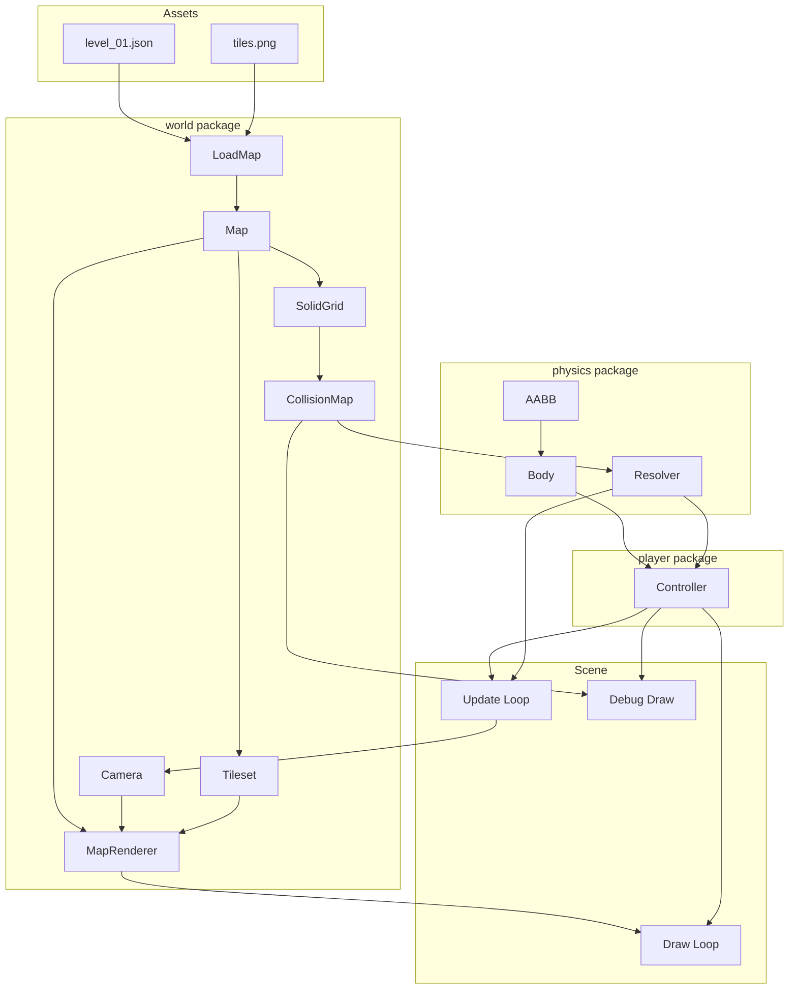

# Tilemap, Collision, and Platformer Controller Design

## Overview

This document outlines the architecture for implementing a tilemap loading system, collision detection, and a simple platformer controller for the GoP Ebitengine game.

---

## Analysis of Existing Patterns

### Key Patterns from Codebase

Based on analysis of the existing codebase, the following patterns should be followed:

1. **Constructor Pattern**: All types use `New()` constructor functions returning pointers
2. **Interface-Based Design**: Clear interface contracts like [`Scene`](internal/app/app.go:12)
3. **Configuration Structs**: Dedicated structs with sensible defaults
4. **Input Abstraction**: Action-based input via [`Input.Pressed()`](internal/input/input.go:46) and [`Input.JustPressed()`](internal/input/input.go:61)
5. **Asset Loading**: Runtime loading via `os.DirFS` with [`SubFS()`](internal/assets/assets.go:21) for subdirectories
6. **Debug Support**: [`SceneDebugger`](internal/app/app.go:24) interface for debug visuals

---

## Proposed Architecture

### Package Structure

```
internal/
├── world/
│   ├── map.go       // Tilemap loading and storage
│   ├── render.go    // Tile rendering with camera
│   └── collision.go // Collision grid and helpers
├── physics/
│   ├── aabb.go      // AABB structure and tests
│   ├── body.go      // Physics body with velocity
│   └── resolve.go   // Collision resolution
└── ...existing packages
```

### Asset Directory Structure

```
assets/
├── sprites/         // Existing sprites
├── tiles/           // Tileset images
│   └── tiles.png    // Main tileset (16x16 tiles)
└── levels/          // Tiled JSON exports
    └── level_01.json
```

---

## 1. Tilemap Loading (`internal/world/map.go`)

### Tiled JSON Format Expectations

The system expects Tiled map editor JSON exports with the following structure:

```json
{
  "width": 40,
  "height": 23,
  "tilewidth": 16,
  "tileheight": 16,
  "layers": [
    {
      "name": "background",
      "type": "tilelayer",
      "width": 40,
      "height": 23,
      "data": [1, 2, 3, ...]
    },
    {
      "name": "collision",
      "type": "tilelayer",
      "data": [0, 0, 1, ...]
    }
  ],
  "tilesets": [
    {
      "firstgid": 1,
      "image": "../tiles/tiles.png",
      "tilewidth": 16,
      "tileheight": 16,
      "imagewidth": 256,
      "imageheight": 256
    }
  ]
}
```

**Key Assumptions**:
- All tiles are the same size (e.g., 16x16)
- Collision layer uses tile ID 0 for empty, non-zero for solid
- Tileset image is embedded alongside the level JSON
- Layers are stored in row-major order (left-to-right, top-to-bottom)

### Data Structures

```go
// Package world provides tilemap loading and collision detection.
package world

// Tileset represents a tileset image with sliced tiles.
type Tileset struct {
    image      *ebiten.Image
    tileWidth  int
    tileHeight int
    tiles      []*ebiten.Image // Pre-sliced tile images
    columns    int             // Number of columns in tileset
}

// NewTileset creates a tileset from an image with uniform tile size.
func NewTileset(img *ebiten.Image, tileWidth, tileHeight int) *Tileset

// Tile returns the tile image at the given global tile ID.
func (t *Tileset) Tile(id int) *ebiten.Image

// TileCount returns the total number of tiles in the tileset.
func (t *Tileset) TileCount() int

// Layer represents a single tile layer from the map.
type Layer struct {
    name   string
    width  int
    height int
    data   []int // Global tile IDs, 0 = empty
}

// Name returns the layer name.
func (l *Layer) Name() string

// TileAt returns the tile ID at the given tile coordinates.
// Returns 0 if coordinates are out of bounds.
func (l *Layer) TileAt(tx, ty int) int

// SetTile sets the tile ID at the given tile coordinates.
func (l *Layer) SetTile(tx, ty, id int)

// Map represents a loaded tilemap with all layers and tileset.
type Map struct {
    width      int          // Width in tiles
    height     int          // Height in tiles
    tileWidth  int          // Tile width in pixels
    tileHeight int          // Tile height in pixels
    layers     []*Layer     // All layers
    tileset    *Tileset     // Tileset reference
    layerIndex map[string]int // Layer name to index mapping
}

// NewMap creates a new empty map with the given dimensions.
func NewMap(width, height, tileWidth, tileHeight int) *Map

// LoadMap loads a map from a Tiled JSON file.
// The tileset image is loaded relative to the JSON file path.
func LoadMap(fsys fs.FS, jsonPath string) (*Map, error)

// Width returns the map width in tiles.
func (m *Map) Width() int

// Height returns the map height in tiles.
func (m *Map) Height() int

// TileWidth returns the tile width in pixels.
func (m *Map) TileWidth() int

// TileHeight returns the tile height in pixels.
func (m *Map) TileHeight() int

// PixelWidth returns the map width in pixels.
func (m *Map) PixelWidth() int

// PixelHeight returns the map height in pixels.
func (m *Map) PixelHeight() int

// Layer returns the layer by name, or nil if not found.
func (m *Map) Layer(name string) *Layer

// AddLayer adds a new layer to the map.
func (m *Map) AddLayer(name string, data []int) *Layer

// Tileset returns the map's tileset.
func (m *Map) Tileset() *Tileset
```

### JSON Parsing Implementation

```go
// tiledMap represents the JSON structure from Tiled.
type tiledMap struct {
    Width      int          `json:"width"`
    Height     int          `json:"height"`
    TileWidth  int          `json:"tilewidth"`
    TileHeight int          `json:"tileheight"`
    Layers     []tiledLayer `json:"layers"`
    Tilesets   []tiledTileset `json:"tilesets"`
}

type tiledLayer struct {
    Name   string `json:"name"`
    Type   string `json:"type"`
    Width  int    `json:"width"`
    Height int    `json:"height"`
    Data   []int  `json:"data"`
}

type tiledTileset struct {
    FirstGID   int    `json:"firstgid"`
    Image      string `json:"image"`
    TileWidth  int    `json:"tilewidth"`
    TileHeight int    `json:"tileheight"`
    ImageWidth int    `json:"imagewidth"`
    ImageHeight int   `json:"imageheight"`
}
```

---

## 2. Tile Rendering (`internal/world/render.go`)

### Camera Structure

```go
// Camera provides viewport offset for scrolling levels.
type Camera struct {
    X, Y       float64 // Camera position (top-left of viewport)
    ViewWidth  int     // Viewport width in pixels
    ViewHeight int     // Viewport height in pixels
}

// NewCamera creates a new camera with the given viewport size.
func NewCamera(viewWidth, viewHeight int) *Camera

// CenterOn centers the camera on the given world position.
func (c *Camera) CenterOn(x, y float64, mapWidth, mapHeight int)

// VisibleBounds returns the visible tile range (tx1, ty1, tx2, ty2).
func (c *Camera) VisibleBounds(tileSize int) (int, int, int, int)

// WorldToScreen converts world coordinates to screen coordinates.
func (c *Camera) WorldToScreen(wx, wy float64) (sx, sy float64)

// ScreenToWorld converts screen coordinates to world coordinates.
func (c *Camera) ScreenToWorld(sx, sy float64) (wx, wy float64)
```

### Map Renderer

```go
// MapRenderer handles rendering a map with camera support.
type MapRenderer struct {
    map    *Map
    camera *Camera
}

// NewMapRenderer creates a new renderer for the given map.
func NewMapRenderer(m *Map, camera *Camera) *MapRenderer

// Draw renders all visible tiles to the screen.
// Only tiles within the camera viewport are drawn.
func (r *MapRenderer) Draw(screen *ebiten.Image)

// DrawLayer renders a specific layer by name.
func (r *MapRenderer) DrawLayer(screen *ebiten.Image, layerName string)

// SetCamera updates the camera reference.
func (r *MapRenderer) SetCamera(camera *Camera)
```

### Rendering Algorithm

```go
func (r *MapRenderer) Draw(screen *ebiten.Image) {
    if r.map == nil || r.camera == nil {
        return
    }

    tileSize := r.map.TileWidth()
    tx1, ty1, tx2, ty2 := r.camera.VisibleBounds(tileSize)

    // Clamp to map bounds
    if tx1 < 0 { tx1 = 0 }
    if ty1 < 0 { ty1 = 0 }
    if tx2 > r.map.Width() { tx2 = r.map.Width() }
    if ty2 > r.map.Height() { ty2 = r.map.Height() }

    // Draw each layer
    for _, layer := range r.map.layers {
        for ty := ty1; ty < ty2; ty++ {
            for tx := tx1; tx < tx2; tx++ {
                tileID := layer.TileAt(tx, ty)
                if tileID == 0 {
                    continue // Empty tile
                }

                tile := r.map.Tileset().Tile(tileID - 1) // Tiled uses 1-based IDs
                if tile == nil {
                    continue
                }

                // Calculate screen position
                worldX := float64(tx * tileSize)
                worldY := float64(ty * tileSize)
                screenX, screenY := r.camera.WorldToScreen(worldX, worldY)

                // Draw tile
                op := &ebiten.DrawImageOptions{}
                op.GeoM.Translate(screenX, screenY)
                screen.DrawImage(tile, op)
            }
        }
    }
}
```

---

## 3. Collision System (`internal/world/collision.go`)

### Solid Grid Structure

```go
// SolidGrid represents a grid of solid tiles for collision detection.
type SolidGrid struct {
    width  int      // Width in tiles
    height int      // Height in tiles
    data   []bool   // true = solid, false = empty
}

// NewSolidGrid creates a new empty grid with the given dimensions.
func NewSolidGrid(width, height int) *SolidGrid

// NewSolidGridFromLayer creates a grid from a collision layer.
// Any non-zero tile ID is considered solid.
func NewSolidGridFromLayer(layer *Layer, width, height int) *SolidGrid

// IsSolidAtTile returns true if the tile at (tx, ty) is solid.
// Returns true for out-of-bounds coordinates.
func (g *SolidGrid) IsSolidAtTile(tx, ty int) bool

// IsSolidAtWorld returns true if the world position is in a solid tile.
func (g *SolidGrid) IsSolidAtWorld(x, y float64, tileSize int) bool

// SetSolid sets the solid state at the given tile coordinates.
func (g *SolidGrid) SetSolid(tx, ty int, solid bool)

// Width returns the grid width in tiles.
func (g *SolidGrid) Width() int

// Height returns the grid height in tiles.
func (g *SolidGrid) Height() int
```

### Collision Helper Functions

```go
// TileAtWorld converts world coordinates to tile coordinates.
func TileAtWorld(x, y float64, tileSize int) (tx, ty int)

// WorldToTile converts world position to tile position.
func WorldToTile(x, y float64, tileWidth, tileHeight int) (tx, ty int)

// TileToWorld converts tile position to world position (top-left corner).
func TileToWorld(tx, ty, tileWidth, tileHeight int) (x, y float64)

// TileCenter returns the world position of a tile's center.
func TileCenter(tx, ty, tileWidth, tileHeight int) (x, y float64)
```

### Collision Map Integration

```go
// CollisionMap provides collision detection for a loaded map.
type CollisionMap struct {
    grid     *SolidGrid
    tileSize int
}

// NewCollisionMap creates a collision map from a map's collision layer.
func NewCollisionMap(m *Map, collisionLayerName string) *CollisionMap

// IsSolidAtTile returns true if the tile is solid.
func (c *CollisionMap) IsSolidAtTile(tx, ty int) bool

// IsSolidAtWorld returns true if the world position is solid.
func (c *CollisionMap) IsSolidAtWorld(x, y float64) bool

// OverlapsSolid checks if an AABB overlaps any solid tiles.
func (c *CollisionMap) OverlapsSolid(x, y, w, h float64) bool

// GetOverlappingTiles returns all tiles that overlap the given AABB.
func (c *CollisionMap) GetOverlappingTiles(x, y, w, h float64) []TileCoord

// TileCoord represents a tile coordinate.
type TileCoord struct {
    X, Y int
}
```

---

## 4. Physics System (`internal/physics/`)

### AABB Structure (`internal/physics/aabb.go`)

```go
// Package physics provides collision detection and resolution.
package physics

// AABB represents an Axis-Aligned Bounding Box.
type AABB struct {
    X, Y float64 // Top-left position
    W, H float64 // Width and height
}

// NewAABB creates a new AABB.
func NewAABB(x, y, w, h float64) AABB

// Left returns the left edge X coordinate.
func (a AABB) Left() float64

// Right returns the right edge X coordinate.
func (a AABB) Right() float64

// Top returns the top edge Y coordinate.
func (a AABB) Top() float64

// Bottom returns the bottom edge Y coordinate.
func (a AABB) Bottom() float64

// CenterX returns the center X coordinate.
func (a AABB) CenterX() float64

// CenterY returns the center Y coordinate.
func (a AABB) CenterY() float64

// Contains checks if a point is inside the AABB.
func (a AABB) Contains(x, y float64) bool

// Overlaps checks if two AABBs overlap.
func (a AABB) Overlaps(other AABB) bool

// Moved returns a new AABB moved by the given delta.
func (a AABB) Moved(dx, dy float64) AABB

// WithPosition returns a new AABB at the given position.
func (a AABB) WithPosition(x, y float64) AABB
```

### Physics Body (`internal/physics/body.go`)

```go
// Body represents a physics body with position, velocity, and bounds.
type Body struct {
    AABB
    VX, VY   float64 // Velocity in pixels per second
    OnGround bool    // Whether body is on solid ground
}

// NewBody creates a new physics body.
func NewBody(x, y, w, h float64) *Body

// Update applies velocity to position (before collision resolution).
func (b *Body) Update(dt float64)

// Bounds returns the current AABB.
func (b *Body) Bounds() AABB

// FutureBounds returns the AABB at the future position after velocity.
func (b *Body) FutureBounds(dt float64) AABB
```

### Collision Resolution (`internal/physics/resolve.go`)

```go
// Resolver handles collision resolution against a tile grid.
type Resolver struct {
    collisionMap *world.CollisionMap
}

// NewResolver creates a new collision resolver.
func NewResolver(collisionMap *world.CollisionMap) *Resolver

// Resolve moves the body and resolves collisions.
// Returns the actual movement delta after collision.
func (r *Resolver) Resolve(body *Body, dt float64) (dx, dy float64)
```

### Axis-Separated Collision Resolution Algorithm

The collision resolution uses axis-separated resolution for stable platformer physics:

```go
// Pseudocode for collision resolution
func (r *Resolver) Resolve(body *Body, dt float64) (dx, dy float64) {
    // Step 1: Apply velocity to get desired movement
    dx = body.VX * dt
    dy = body.VY * dt
    
    // Step 2: Resolve X-axis collision first
    if dx != 0 {
        body.X += dx
        
        // Check for collision after X movement
        if r.checkCollision(body) {
            // Snap to tile edge and stop X velocity
            if dx > 0 {
                // Moving right - snap to left edge of colliding tile
                body.X = r.snapLeft(body) - body.W
            } else {
                // Moving left - snap to right edge of colliding tile
                body.X = r.snapRight(body)
            }
            body.VX = 0
            dx = 0
        }
    }
    
    // Step 3: Resolve Y-axis collision
    if dy != 0 {
        body.Y += dy
        body.OnGround = false // Reset ground state
        
        // Check for collision after Y movement
        if r.checkCollision(body) {
            // Snap to tile edge and stop Y velocity
            if dy > 0 {
                // Moving down - snap to top edge of colliding tile (landing)
                body.Y = r.snapTop(body) - body.H
                body.OnGround = true
            } else {
                // Moving up - snap to bottom edge of colliding tile (ceiling)
                body.Y = r.snapBottom(body)
            }
            body.VY = 0
            dy = 0
        }
    }
    
    return dx, dy
}

// checkCollision checks if the body overlaps any solid tiles
func (r *Resolver) checkCollision(body *Body) bool {
    return r.collisionMap.OverlapsSolid(body.X, body.Y, body.W, body.H)
}

// snapLeft returns the left edge X of the colliding tile
func (r *Resolver) snapLeft(body *Body) float64 {
    tiles := r.collisionMap.GetOverlappingTiles(body.X, body.Y, body.W, body.H)
    minX := float64(math.MaxFloat64)
    tileSize := r.collisionMap.tileSize
    for _, t := range tiles {
        if r.collisionMap.IsSolidAtTile(t.X, t.Y) {
            tileLeft := float64(t.X * tileSize)
            if tileLeft < minX {
                minX = tileLeft
            }
        }
    }
    return minX
}

// Similar for snapRight, snapTop, snapBottom...
```

**Why Axis-Separated Resolution?**

1. **Predictable behavior**: Each axis is resolved independently
2. **No corner sticking**: Player slides along walls instead of getting stuck
3. **Accurate ground detection**: Y-resolution after X ensures proper landing
4. **Simple implementation**: No complex vector math required

---

## 5. Player Controller (`internal/player/controller.go`)

### Controller Structure

```go
// Package player provides the player controller.
package player

// Controller handles player input and physics.
type Controller struct {
    body       *physics.Body
    speed      float64 // Horizontal movement speed (pixels/second)
    jumpForce  float64 // Initial jump velocity (pixels/second)
    gravity    float64 // Gravity acceleration (pixels/second²)
    maxFall    float64 // Maximum fall speed (pixels/second)
}

// NewController creates a new player controller.
func NewController(x, y, w, h float64) *Controller {
    return &Controller{
        body:      physics.NewBody(x, y, w, h),
        speed:     150.0,   // 150 pixels/second
        jumpForce: -300.0,  // Jump velocity (negative = up)
        gravity:   800.0,   // 800 pixels/second²
        maxFall:   400.0,   // 400 pixels/second max fall
    }
}

// Update processes input and updates physics.
func (c *Controller) Update(inp *input.Input, resolver *physics.Resolver, dt float64) {
    // Horizontal movement
    c.body.VX = 0
    if inp.Pressed(input.ActionMoveLeft) {
        c.body.VX = -c.speed
    }
    if inp.Pressed(input.ActionMoveRight) {
        c.body.VX = c.speed
    }
    
    // Jump (only when grounded)
    if inp.JustPressed(input.ActionJump) && c.body.OnGround {
        c.body.VY = c.jumpForce
        c.body.OnGround = false
    }
    
    // Apply gravity
    c.body.VY += c.gravity * dt
    if c.body.VY > c.maxFall {
        c.body.VY = c.maxFall
    }
    
    // Resolve collisions
    resolver.Resolve(c.body, dt)
}

// Position returns the player position.
func (c *Controller) Position() (x, y float64)

// Bounds returns the player AABB.
func (c *Controller) Bounds() physics.AABB

// IsGrounded returns true if player is on ground.
func (c *Controller) IsGrounded() bool
```

### Input Actions Required

Add to [`internal/input/input.go`](internal/input/input.go:11):

```go
const (
    ActionMoveLeft Action = iota
    ActionMoveRight
    ActionMoveUp
    ActionMoveDown
    ActionJump     // New: Jump action
    ActionQuit
    ActionDebugToggle
)

// In NewInput():
i.keyMap[ActionJump] = []ebiten.Key{ebiten.KeySpace, ebiten.KeyW, ebiten.KeyArrowUp}
```

---

## 6. Debug Visualization

### Collision Debug Drawing

```go
// DebugRenderer draws collision debug visuals.
type DebugRenderer struct {
    collisionMap *world.CollisionMap
    camera       *Camera
    showGrid     bool
    showPlayer   bool
}

// NewDebugRenderer creates a debug renderer.
func NewDebugRenderer(collisionMap *world.CollisionMap, camera *Camera) *DebugRenderer

// Draw renders debug visuals.
func (d *DebugRenderer) Draw(screen *ebiten.Image, player *player.Controller) {
    // Draw solid tile overlay
    if d.showGrid {
        d.drawSolidTiles(screen)
    }
    
    // Draw player AABB
    if d.showPlayer {
        d.drawPlayerBounds(screen, player)
    }
}

// drawSolidTiles highlights all solid tiles in red.
func (d *DebugRenderer) drawSolidTiles(screen *ebiten.Image)

// drawPlayerBounds draws the player collision rectangle.
func (d *DebugRenderer) drawPlayerBounds(screen *ebiten.Image, player *player.Controller)
```

### Integration with SceneDebugger

The sandbox scene can implement [`SceneDebugger`](internal/app/app.go:24) to draw collision visuals:

```go
// In internal/scenes/sandbox/scene.go

// DrawDebug implements app.SceneDebugger.DrawDebug.
func (s *Scene) DrawDebug(screen *ebiten.Image) {
    // Draw collision grid overlay
    s.debugRenderer.Draw(screen, s.player)
}
```

**Note**: F2 toggle can be added as a separate debug mode for collision visualization, distinct from the existing F1 debug overlay.

---

## 7. Asset Embedding Strategy

### Current Approach

The existing codebase uses runtime loading via `os.DirFS`:

```go
// From internal/assets/assets.go
func FS() fs.FS {
    return os.DirFS(AssetsDir)
}
```

### Recommended Approach for Tilemaps

For production builds, embed assets using `go:embed`:

```go
// internal/assets/embed.go

//go:embed assets/*
var gameAssets embed.FS

// FS returns the embedded filesystem.
func FS() fs.FS {
    return gameAssets
}

// SubFS returns a sub-filesystem rooted at the given path.
func SubFS(name string) (fs.FS, error) {
    return fs.Sub(gameAssets, "assets/"+name)
}
```

### Loading Level and Tileset

```go
// In scene initialization:

// Load level from embedded assets
levelFS, err := assets.SubFS("levels")
if err != nil {
    return err
}

gameMap, err := world.LoadMap(levelFS, "level_01.json")
if err != nil {
    return err
}

// Tileset image is loaded relative to the JSON file path
// The LoadMap function handles this internally
```

### Asset Placement

```
assets/
├── sprites/
│   └── test_sheet.png    // Existing
├── tiles/
│   └── tiles.png         // Tileset image (e.g., 256x256 with 16x16 tiles)
└── levels/
    └── level_01.json     // Tiled export referencing ../tiles/tiles.png
```

---

## 8. Integration Points

### Scene Integration

```go
// internal/scenes/sandbox/scene.go

type Scene struct {
    // Map and rendering
    gameMap      *world.Map
    renderer     *world.MapRenderer
    camera       *world.Camera
    
    // Collision
    collisionMap *world.CollisionMap
    resolver     *physics.Resolver
    
    // Player
    player       *player.Controller
    
    // Debug
    debugRenderer *world.DebugRenderer
    
    // Existing
    width, height int
}

func New() *Scene {
    s := &Scene{
        width:  640,
        height: 360,
    }
    
    // Load map
    levelFS, _ := assets.SubFS("levels")
    s.gameMap, _ = world.LoadMap(levelFS, "level_01.json")
    
    // Setup camera
    s.camera = world.NewCamera(640, 360)
    
    // Setup rendering
    s.renderer = world.NewMapRenderer(s.gameMap, s.camera)
    
    // Setup collision
    s.collisionMap = world.NewCollisionMap(s.gameMap, "collision")
    s.resolver = physics.NewResolver(s.collisionMap)
    
    // Setup player (spawn position from map or hardcoded)
    s.player = player.NewController(100, 100, 14, 16) // 14x16 player hitbox
    
    // Setup debug
    s.debugRenderer = world.NewDebugRenderer(s.collisionMap, s.camera)
    
    return s
}

func (s *Scene) Update(inp *input.Input) error {
    dt := 1.0 / 60.0 // Fixed timestep
    
    // Update player
    s.player.Update(inp, s.resolver, dt)
    
    // Update camera to follow player
    px, py := s.player.Position()
    s.camera.CenterOn(px, py, s.gameMap.PixelWidth(), s.gameMap.PixelHeight())
    
    return nil
}

func (s *Scene) Draw(screen *ebiten.Image) {
    screen.Fill(backgroundColor)
    
    // Draw map
    s.renderer.Draw(screen)
    
    // Draw player (using sprite or simple rect)
    s.drawPlayer(screen)
}

func (s *Scene) DrawDebug(screen *ebiten.Image) {
    s.debugRenderer.Draw(screen, s.player)
}
```

---

## 9. Data Flow Diagram



---

## 10. Implementation Checklist

### Phase 1: Tilemap Loading
- [ ] Create `internal/world/map.go` with `Map`, `Layer`, `Tileset` structs
- [ ] Implement Tiled JSON parsing
- [ ] Implement tileset image loading and slicing
- [ ] Add `assets/levels/` and `assets/tiles/` directories
- [ ] Create sample level JSON and tileset PNG

### Phase 2: Rendering
- [ ] Create `internal/world/render.go` with `Camera` and `MapRenderer`
- [ ] Implement viewport culling for performance
- [ ] Integrate with existing `gfx.Sprite` for player rendering

### Phase 3: Collision
- [ ] Create `internal/world/collision.go` with `SolidGrid` and `CollisionMap`
- [ ] Implement `IsSolidAtTile()` and `IsSolidAtWorld()` helpers
- [ ] Implement `OverlapsSolid()` for AABB collision

### Phase 4: Physics
- [ ] Create `internal/physics/aabb.go` with AABB struct
- [ ] Create `internal/physics/body.go` with Body struct
- [ ] Create `internal/physics/resolve.go` with axis-separated resolution
- [ ] Implement gravity and ground detection

### Phase 5: Player Controller
- [ ] Create `internal/player/controller.go`
- [ ] Add `ActionJump` to input system
- [ ] Implement horizontal movement and jump logic
- [ ] Test collision resolution with player

### Phase 6: Debug & Polish
- [ ] Create `internal/world/debug.go` with `DebugRenderer`
- [ ] Add F2 toggle for collision visualization
- [ ] Integrate with `SceneDebugger` interface
- [ ] Performance testing with large maps

---

## 11. Notes and Considerations

### Performance
- **Viewport culling**: Only draw tiles visible in camera
- **Pre-sliced tileset**: Tiles are sliced once at load time
- **Simple collision**: Grid-based collision is O(1) lookup

### Extensibility
- **Multiple tilesets**: Design supports multiple tilesets via `firstgid`
- **Object layers**: Can be added later for spawn points, triggers
- **Animated tiles**: Can be added with tile properties

### Limitations
- **Single collision layer**: Current design assumes one collision layer
- **No slopes**: Grid collision only supports rectangular tiles
- **No moving platforms**: Static collision only

### Future Enhancements
- **Tile animations**: Support for animated tiles in Tiled
- **Object layers**: Spawn points, collectibles, triggers
- **Multiple maps**: Level streaming or room-based loading
- **Slope tiles**: One-way platforms, 45-degree slopes
