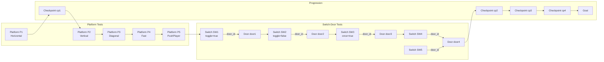

# Level 01 Comprehensive Test Design Document

## Overview

This document provides a detailed design for `level_01.json` that tests ALL game features in a single comprehensive level. The design follows a linear progression from spawn to goal, with distinct test sections for each feature type.

---

## 1. Level Layout Overview

### Dimensions
- **Width:** 80 tiles (1280 pixels)
- **Height:** 25 tiles (400 pixels)
- **Tile Size:** 16×16 pixels

### Level Flow

```
START -> Platform Tests -> Switch-Door Tests -> Hazard Challenge -> Checkpoint Progression -> GOAL
```

The level is divided into 4 main sections arranged horizontally:

1. **Section A (Tiles 0-19):** Platform Testing Zone
2. **Section B (Tiles 20-39):** Switch-Door Testing Zone  
3. **Section C (Tiles 40-59):** Hazard Challenge Zone
4. **Section D (Tiles 60-79):** Final Challenge & Goal

---

## 2. ASCII Level Layout

```
TILES:  0         10        20        30        40        50        60        70        80
        |         |         |         |         |         |         |         |         |
Y=0  ###==========================================================================================###
     ###    PLATFORM ZONE        |    SWITCH-DOOR ZONE    |   HAZARD ZONE   |   GOAL ZONE    ###
     ###                                                                                         ###
Y=4  ###                    [P1]      [D1]        [D2]                  [CP3]                      ###
     ###         [P2]                  [SW1]      [SW2]                                            ###
Y=6  ###              [P3]                        [D3]        [H1-H4]         [CP4]    [GOAL]   ###
     ###         [P4]    [P5]         [SW3]      [SW4]                            [D4]             ###
Y=8  ###                                                                                         ###
     ###=============================================================================================###
Y=10 ###         [CP1]                          [CP2]                                           ###
     ###                                                                                           ###
Y=12 ###              [H1]    [H2]              [H3]    [H4]                                     ###
     ###                                                                                           ###
Y=14 ###=============================================================================================###
     ###                                                                                           ###
Y=16 ###                                                                                           ###
     ###                                                                                           ###
Y=18 ###                                                                                           ###
     ###=============================================================================================###
Y=20 ###                                                                                           ###
     ###=============================================================================================###
Y=22 ###SSSSSSSSSSSSSSSSSSSSSSSSSSSSSSSSSSSSSSSSSSSSSSSSSSSSSSSSSSSSSSSSSSSSSSSSSSSSSSSSSSSSSSSSSSS###
Y=24 ###GGGGGGGGGGGGGGGGGGGGGGGGGGGGGGGGGGGGGGGGGGGGGGGGGGGGGGGGGGGGGGGGGGGGGGGGGGGGGGGGGGGGGGGGGGG###

LEGEND:
  SSS = Spawn area (ground level)
  GGG = Ground tiles
  ### = Solid platforms/walls
  [P1-P5] = Moving platforms
  [D1-D4] = Doors
  [SW1-SW4] = Switches
  [H1-H4] = Hazards
  [CP1-CP4] = Checkpoints
  [GOAL] = Goal
  | = Section dividers
```

---

## 3. Detailed Section Designs

### Section A: Platform Testing Zone (Tiles 0-19)

This section tests all moving platform behaviors.

#### Ground Structure
- Solid ground at Y=22-24 (rows 22-24)
- Elevated platforms at Y=4, Y=6, Y=10 for platform access

#### Platform Entities

| ID | Type | Position | End Position | Speed | Wait | Push | Description |
|----|------|----------|--------------|-------|------|------|-------------|
| P1 | Horizontal | (96, 288) | (256, 288) | 60 | 1.0 | false | Basic horizontal platform |
| P2 | Vertical | (320, 240) | (320, 160) | 45 | 1.5 | false | Elevator-style vertical platform |
| P3 | Diagonal | (400, 288) | (480, 208) | 50 | 1.0 | false | Diagonal moving platform |
| P4 | Fast | (528, 288) | (640, 288) | 120 | 0.3 | false | High-speed horizontal platform |
| P5 | Push | (672, 288) | (800, 288) | 60 | 1.0 | true | Platform with pushPlayer enabled |

### Section B: Switch-Door Testing Zone (Tiles 20-39)

This section tests all switch and door interaction modes.

#### Switch-Door Entities

| Switch ID | Position | Target Door | Toggle | Once | Description |
|-----------|----------|-------------|--------|------|-------------|
| SW1 | (352, 336) | door1 | true | false | Toggle switch (default behavior) |
| SW2 | (432, 336) | door2 | false | false | Hold-open switch (door closes when player leaves) |
| SW3 | (512, 336) | door3 | true | true | One-shot switch (deactivates after use) |
| SW4 | (592, 336) | door4 | true | false | Multi-switch target (paired with SW5) |
| SW5 | (672, 336) | door4 | true | false | Second switch for door4 |

#### Door Entities

| Door ID | Position | Size | Start Open | Description |
|---------|----------|------|-----------|-------------|
| door1 | (368, 272) | 32×64 | false | Toggle door (SW1) |
| door2 | (448, 272) | 32×64 | false | Hold-open door (SW2) |
| door3 | (528, 272) | 32×64 | false | One-shot door (SW3) |
| door4 | (608, 272) | 32×64 | false | Multi-switch door (SW4 + SW5) |

### Section C: Hazard Challenge Zone (Tiles 40-59)

This section tests hazard placement and player avoidance.

#### Hazard Entities

| ID | Position | Size | Description |
|----|----------|------|-------------|
| H1 | (688, 336) | 48×16 | Ground hazard (basic) |
| H2 | (768, 336) | 32×16 | Ground hazard (gap) |
| H3 | (848, 240) | 64×16 | Elevated hazard near platform |
| H4 | (944, 208) | 32×16 | Hazard near door (timing challenge) |

### Section D: Final Challenge & Goal (Tiles 60-79)

This section combines elements and leads to the goal.

#### Checkpoint Entities

| ID | Position | Size | Description |
|----|----------|------|-------------|
| cp1 | (160, 288) | 32×64 | After platform zone |
| cp2 | (560, 288) | 32×64 | After switch-door zone |
| cp3 | (880, 288) | 32×64 | After hazard zone |
| cp4 | (1088, 288) | 32×64 | Before goal |

#### Goal Entity

| Position | Size | Description |
|----------|------|-------------|
| (1200, 288) | 32×64 | Level completion goal |

---

## 4. Complete Entity Specifications

### Spawn Entity

```json
{
  "id": 1,
  "name": "PlayerSpawn",
  "type": "spawn",
  "x": 32,
  "y": 320,
  "width": 32,
  "height": 32
}
```

### Moving Platforms

#### P1: Horizontal Platform
```json
{
  "id": 10,
  "name": "Platform_Horizontal",
  "type": "platform",
  "x": 96,
  "y": 288,
  "width": 80,
  "height": 16,
  "properties": [
    {"name": "id", "type": "string", "value": "p1"},
    {"name": "endX", "type": "float", "value": 256},
    {"name": "endY", "type": "float", "value": 288},
    {"name": "speed", "type": "float", "value": 60},
    {"name": "waitTime", "type": "float", "value": 1.0},
    {"name": "pushPlayer", "type": "bool", "value": false}
  ]
}
```

#### P2: Vertical Platform (Elevator)
```json
{
  "id": 11,
  "name": "Platform_Vertical",
  "type": "platform",
  "x": 320,
  "y": 240,
  "width": 64,
  "height": 16,
  "properties": [
    {"name": "id", "type": "string", "value": "p2"},
    {"name": "endX", "type": "float", "value": 320},
    {"name": "endY", "type": "float", "value": 160},
    {"name": "speed", "type": "float", "value": 45},
    {"name": "waitTime", "type": "float", "value": 1.5},
    {"name": "pushPlayer", "type": "bool", "value": false}
  ]
}
```

#### P3: Diagonal Platform
```json
{
  "id": 12,
  "name": "Platform_Diagonal",
  "type": "platform",
  "x": 400,
  "y": 288,
  "width": 64,
  "height": 16,
  "properties": [
    {"name": "id", "type": "string", "value": "p3"},
    {"name": "endX", "type": "float", "value": 480},
    {"name": "endY", "type": "float", "value": 208},
    {"name": "speed", "type": "float", "value": 50},
    {"name": "waitTime", "type": "float", "value": 1.0},
    {"name": "pushPlayer", "type": "bool", "value": false}
  ]
}
```

#### P4: Fast Platform
```json
{
  "id": 13,
  "name": "Platform_Fast",
  "type": "platform",
  "x": 528,
  "y": 288,
  "width": 64,
  "height": 16,
  "properties": [
    {"name": "id", "type": "string", "value": "p4"},
    {"name": "endX", "type": "float", "value": 640},
    {"name": "endY", "type": "float", "value": 288},
    {"name": "speed", "type": "float", "value": 120},
    {"name": "waitTime", "type": "float", "value": 0.3},
    {"name": "pushPlayer", "type": "bool", "value": false}
  ]
}
```

#### P5: Push Player Platform
```json
{
  "id": 14,
  "name": "Platform_Push",
  "type": "platform",
  "x": 672,
  "y": 288,
  "width": 80,
  "height": 16,
  "properties": [
    {"name": "id", "type": "string", "value": "p5"},
    {"name": "endX", "type": "float", "value": 800},
    {"name": "endY", "type": "float", "value": 288},
    {"name": "speed", "type": "float", "value": 60},
    {"name": "waitTime", "type": "float", "value": 1.0},
    {"name": "pushPlayer", "type": "bool", "value": true}
  ]
}
```

### Switches

#### SW1: Toggle Switch
```json
{
  "id": 20,
  "name": "Switch_Toggle",
  "type": "switch",
  "x": 352,
  "y": 336,
  "width": 32,
  "height": 16,
  "properties": [
    {"name": "door_id", "type": "string", "value": "door1"},
    {"name": "toggle", "type": "bool", "value": true},
    {"name": "once", "type": "bool", "value": false}
  ]
}
```

#### SW2: Hold-Open Switch
```json
{
  "id": 21,
  "name": "Switch_HoldOpen",
  "type": "switch",
  "x": 432,
  "y": 336,
  "width": 32,
  "height": 16,
  "properties": [
    {"name": "door_id", "type": "string", "value": "door2"},
    {"name": "toggle", "type": "bool", "value": false},
    {"name": "once", "type": "bool", "value": false}
  ]
}
```

#### SW3: One-Shot Switch
```json
{
  "id": 22,
  "name": "Switch_OneShot",
  "type": "switch",
  "x": 512,
  "y": 336,
  "width": 32,
  "height": 16,
  "properties": [
    {"name": "door_id", "type": "string", "value": "door3"},
    {"name": "toggle", "type": "bool", "value": true},
    {"name": "once", "type": "bool", "value": true}
  ]
}
```

#### SW4: Multi-Switch A
```json
{
  "id": 23,
  "name": "Switch_MultiA",
  "type": "switch",
  "x": 592,
  "y": 336,
  "width": 32,
  "height": 16,
  "properties": [
    {"name": "door_id", "type": "string", "value": "door4"},
    {"name": "toggle", "type": "bool", "value": true},
    {"name": "once", "type": "bool", "value": false}
  ]
}
```

#### SW5: Multi-Switch B
```json
{
  "id": 24,
  "name": "Switch_MultiB",
  "type": "switch",
  "x": 672,
  "y": 336,
  "width": 32,
  "height": 16,
  "properties": [
    {"name": "door_id", "type": "string", "value": "door4"},
    {"name": "toggle", "type": "bool", "value": true},
    {"name": "once", "type": "bool", "value": false}
  ]
}
```

### Doors

#### Door1: Toggle Door
```json
{
  "id": 30,
  "name": "Door_Toggle",
  "type": "door",
  "x": 368,
  "y": 272,
  "width": 32,
  "height": 64,
  "properties": [
    {"name": "id", "type": "string", "value": "door1"},
    {"name": "startOpen", "type": "bool", "value": false}
  ]
}
```

#### Door2: Hold-Open Door
```json
{
  "id": 31,
  "name": "Door_HoldOpen",
  "type": "door",
  "x": 448,
  "y": 272,
  "width": 32,
  "height": 64,
  "properties": [
    {"name": "id", "type": "string", "value": "door2"},
    {"name": "startOpen", "type": "bool", "value": false}
  ]
}
```

#### Door3: One-Shot Door
```json
{
  "id": 32,
  "name": "Door_OneShot",
  "type": "door",
  "x": 528,
  "y": 272,
  "width": 32,
  "height": 64,
  "properties": [
    {"name": "id", "type": "string", "value": "door3"},
    {"name": "startOpen", "type": "bool", "value": false}
  ]
}
```

#### Door4: Multi-Switch Door
```json
{
  "id": 33,
  "name": "Door_MultiSwitch",
  "type": "door",
  "x": 608,
  "y": 272,
  "width": 32,
  "height": 64,
  "properties": [
    {"name": "id", "type": "string", "value": "door4"},
    {"name": "startOpen", "type": "bool", "value": false}
  ]
}
```

### Hazards

```json
{
  "id": 40,
  "name": "Hazard_Ground1",
  "type": "hazard",
  "x": 688,
  "y": 336,
  "width": 48,
  "height": 16
}
```

```json
{
  "id": 41,
  "name": "Hazard_Ground2",
  "type": "hazard",
  "x": 768,
  "y": 336,
  "width": 32,
  "height": 16
}
```

```json
{
  "id": 42,
  "name": "Hazard_Elevated",
  "type": "hazard",
  "x": 848,
  "y": 240,
  "width": 64,
  "height": 16
}
```

```json
{
  "id": 43,
  "name": "Hazard_Timing",
  "type": "hazard",
  "x": 944,
  "y": 208,
  "width": 32,
  "height": 16
}
```

### Checkpoints

```json
{
  "id": 50,
  "name": "Checkpoint_1",
  "type": "checkpoint",
  "x": 160,
  "y": 288,
  "width": 32,
  "height": 64,
  "properties": [
    {"name": "id", "type": "string", "value": "cp1"}
  ]
}
```

```json
{
  "id": 51,
  "name": "Checkpoint_2",
  "type": "checkpoint",
  "x": 560,
  "y": 288,
  "width": 32,
  "height": 64,
  "properties": [
    {"name": "id", "type": "string", "value": "cp2"}
  ]
}
```

```json
{
  "id": 52,
  "name": "Checkpoint_3",
  "type": "checkpoint",
  "x": 880,
  "y": 288,
  "width": 32,
  "height": 64,
  "properties": [
    {"name": "id", "type": "string", "value": "cp3"}
  ]
}
```

```json
{
  "id": 53,
  "name": "Checkpoint_4",
  "type": "checkpoint",
  "x": 1088,
  "y": 288,
  "width": 32,
  "height": 64,
  "properties": [
    {"name": "id", "type": "string", "value": "cp4"}
  ]
}
```

### Goal

```json
{
  "id": 60,
  "name": "Goal",
  "type": "goal",
  "x": 1200,
  "y": 288,
  "width": 32,
  "height": 64
}
```

---

## 5. Entity Relationships Diagram



---

## 6. JSON Structure Outline

The complete level JSON should follow this structure:

```json
{
  "compressionlevel": -1,
  "height": 25,
  "infinite": false,
  "layers": [
    {
      "data": [...],
      "height": 25,
      "id": 1,
      "name": "Tiles",
      "opacity": 1,
      "type": "tilelayer",
      "visible": true,
      "width": 80,
      "x": 0,
      "y": 0
    },
    {
      "data": [...],
      "height": 25,
      "id": 2,
      "name": "Collision",
      "opacity": 1,
      "type": "tilelayer",
      "visible": true,
      "width": 80,
      "x": 0,
      "y": 0
    },
    {
      "draworder": "topdown",
      "name": "Objects",
      "objects": [
        // Spawn
        {...},
        // Platforms (P1-P5)
        {...},
        // Switches (SW1-SW5)
        {...},
        // Doors (door1-door4)
        {...},
        // Hazards (H1-H4)
        {...},
        // Checkpoints (cp1-cp4)
        {...},
        // Goal
        {...}
      ],
      "opacity": 1,
      "type": "objectgroup",
      "visible": true,
      "x": 0,
      "y": 0
    }
  ],
  "nextlayerid": 4,
  "nextobjectid": 61,
  "orientation": "orthogonal",
  "renderorder": "right-down",
  "tiledversion": "1.10.2",
  "tileheight": 16,
  "tilesets": [...],
  "tilewidth": 16,
  "type": "map",
  "version": "1.10",
  "width": 80
}
```

---

## 7. Feature Test Matrix

| Feature | Entity | Test Description | Expected Behavior |
|---------|--------|------------------|-------------------|
| Horizontal Platform | P1 | Ride platform left-right | Player moves with platform |
| Vertical Platform | P2 | Ride platform up-down | Player moves with platform, can jump off |
| Diagonal Platform | P3 | Ride platform diagonally | Player moves with platform at angle |
| Fast Platform | P4 | Quick timing challenge | Player must time jump precisely |
| PushPlayer | P5 | Platform pushes player | Player is pushed sideways when on platform |
| Toggle Switch | SW1 | Step on switch multiple times | Door toggles open/closed each touch |
| Hold-Open Switch | SW2 | Stand on switch | Door opens while on switch, closes when leave |
| One-Shot Switch | SW3 | Step on switch once | Switch deactivates after first use, door stays open |
| Multi-Switch | SW4+SW5 | Either switch controls door4 | Both switches can toggle door4 |
| Ground Hazard | H1, H2 | Walk into hazard | Player respawns at last checkpoint |
| Elevated Hazard | H3 | Jump near hazard | Player must avoid hazard in air |
| Timing Hazard | H4 | Hazard near door | Player must time door entry |
| Checkpoint | cp1-cp4 | Touch checkpoint | Respawn point updated |
| Goal | Goal | Reach goal | Level complete |

---

## 8. Implementation Notes

### Tile Layer Design
- Use tile ID 1 for solid ground (top surface)
- Use tile ID 2 for underground (below surface)
- Use tile ID 3 for decorative platforms
- Use tile ID 4 for special tiles

### Collision Layer Design
- Match collision layer to visual tiles
- Ensure platforms have proper collision
- Leave gaps for doors and moving platform paths

### Visual Indicators
- Consider using different colored tiles for each section
- Add visual cues for switch types (color coding)
- Make hazards visually distinct

### Difficulty Progression
1. **Easy:** Platform zone (P1-P3) - forgiving timing
2. **Medium:** Fast platform (P4) and switch puzzles
3. **Hard:** Push platform (P5) and hazard challenges
4. **Final:** Combined challenges before goal

---

## 9. Summary

This design creates a comprehensive test level that:

- **Tests all 7 entity types:** Spawn, MovingPlatform, Door, Switch, Hazard, Checkpoint, Goal
- **Tests all platform variants:** Horizontal, vertical, diagonal, fast, pushPlayer
- **Tests all switch modes:** Toggle, hold-open (toggle=false), one-shot (once=true), multi-switch
- **Includes 4 checkpoints:** Placed after each major challenge section
- **Features varied hazards:** Ground, elevated, and timing-based placements
- **Provides clear progression:** Linear flow from start to goal with increasing difficulty

The level width is expanded from 40 to 80 tiles to accommodate all test scenarios while maintaining the original height of 25 tiles for consistency with the existing level structure.